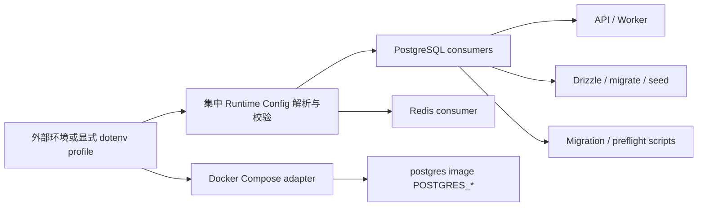

## Context

cnode-next 的运行时连接配置由 API、moderation worker、`packages/db`、Drizzle Kit、数据迁移脚本和部署 preflight 共同消费。当前 PostgreSQL 使用泛化的 `DB_*`，应用配置使用泛化的 `APP_*`，多个消费者还分别实现必填校验、默认值和连接字符串拼装；生产 Compose 则重复枚举同一组环境变量。

本 change 是跨应用、包、脚本、文档和生产部署的破坏性配置契约变更。用户已决定一次性替换，不接受旧变量 alias、fallback 或兼容窗口。所有真实 dotenv 和外部配置均属于人工管理边界，实施过程不得读取或修改它们。

## Goals / Non-Goals

**Goals:**

- 用 `CNODE_*` 表达应用配置归属，用 `POSTGRES_*`、`REDIS_*` 表达基础设施资源及属性。
- 为 PostgreSQL 与 Redis 建立唯一、可校验的项目运行时契约。
- 让所有消费者复用同一套字段语义、默认值和错误规则。
- 将官方镜像变量限制在 Compose adapter，并完成无兼容层的硬切换。
- 保护未跟踪 dotenv、外部 secret、数据库数据和数据卷。

**Non-Goals:**

- 不修改 PostgreSQL schema、数据、角色密码或数据卷。
- 不自动迁移任何真实 dotenv 或外部部署配置。
- 不引入 `DATABASE_URL`、SQLite、dialect fallback 或多数据库支持。
- 不在本 change 中全面重命名 SMTP、OSS、Auth 等其他能力变量。
- 不改变 legacy `nodeclub/` 或 `egg-cnode/`，也不改变论坛业务行为。

## Decisions

### 1. 应用与基础设施使用不同语义前缀

原 `APP_*` 应用配置采用 `CNODE_*` 前缀并保持字段后缀语义。PostgreSQL 使用 `POSTGRES_HOST`、`POSTGRES_PORT`、`POSTGRES_DB`、`POSTGRES_USER`、`POSTGRES_PASSWORD`；Redis 保持 `REDIS_HOST`、`REDIS_PORT`、`REDIS_DB`、`REDIS_PASSWORD`。部署环境不进入变量名，同一契约通过不同 profile 提供不同值。

拒绝为 PostgreSQL 和 Redis 增加 `CNODE_`：资源前缀已经明确表达配置用途，额外项目命名空间只会增加长度。拒绝继续使用 `DB_*`：项目只支持 PostgreSQL，泛化前缀隐藏了实际依赖。

### 2. PostgreSQL 与 Redis 使用显式字段而非 URL

PostgreSQL 唯一契约为：

- `POSTGRES_HOST`
- `POSTGRES_PORT`，缺省为 `5432`
- `POSTGRES_DB`
- `POSTGRES_USER`
- `POSTGRES_PASSWORD`

Redis 唯一契约为：

- `REDIS_HOST`
- `REDIS_PORT`，缺省为 `6379`
- `REDIS_DB`，缺省为 `0`
- `REDIS_PASSWORD`，可为空

拒绝 `DATABASE_URL`：Compose 无法安全拆分初始化字段，URL 需要额外处理密码编码，也更容易被整体输出。PostgreSQL 客户端使用结构化连接参数，不再手工拼接 URL。Redis 未配置真实连接的测试必须注入或选择 mock 边界，而不是依赖部分变量静默回退。

### 3. 集中解析是纯逻辑，dotenv 选择是 I/O 边界

在可被 workspace 消费者复用的模块中提供无文件 I/O 的 typed parser，输入显式 env map，输出 PostgreSQL 或 Redis config。parser 负责：

- 必填值与非空值校验；
- 端口、Redis database index 的整数和范围校验；
- 唯一默认值；
- 只在错误中报告变量名，不报告 secret 值。

API、DB 包、Drizzle 配置和脚本不得自行解释这些字段。现有 dotenv loader 只负责根 `.env`、外部环境和 `CNODE_ENV_FILE` 的优先级，不承担资源配置语义。拒绝让每个消费者保留自己的默认值，因为这会使同一进程契约产生分叉。

### 4. Compose 通过 env_file 直接注入配置

生产 Compose 的运行时 service 与 PostgreSQL、Redis service 均通过 `env_file` 读取同一配置文件。`POSTGRES_DB`、`POSTGRES_USER` 和 `POSTGRES_PASSWORD` 可被 PostgreSQL 官方镜像直接消费，不再增加 adapter 映射。

API、Web、worker 和运维 service 通过同一 `env_file` 接收运行时配置。Compose 只描述拓扑、依赖、挂载、命令和少量容器专用覆盖，不重复枚举整套运行时变量。

### 5. 采用仓库与部署原子硬切换

实现提交必须同步替换代码、受版本控制模板、Compose、测试、活跃 specs 和文档。仓库内不得保留旧变量运行时引用，也不加入 deprecated alias。生产部署时，运维必须先在受控部署窗口准备新的外部变量，再用同一版本 Compose 重建应用容器。

拒绝临时兼容：用户明确要求一次性替换；兼容读取会延长双契约状态并掩盖遗漏。代码回滚必须与环境配置回滚成对进行，不能依赖新版本接受旧变量。

### 6. 真实 dotenv 是不可触碰的人工边界

自动实施仅修改 tracked templates。真实 dotenv 文件不得被读取、打印、编辑、覆盖、删除或自动转换。实现验证不得通过 source 真实 dotenv 后输出环境；需要验证配置时使用占位 fixture 或显式临时环境。

## Risks / Trade-offs

- [生产变量未同步导致 API、worker 或 CLI 启动失败] → 在部署前用不含真实值的 Compose config 检查变量完整性，并将环境更新与镜像切换放在同一维护窗口。
- [硬切换没有兼容回旋空间] → 将仓库和部署变更视为一个 release unit；回滚时同时恢复上一版本代码和上一套环境变量名称。
- [parser 错误意外包含 secret] → 错误只列缺失或无效的变量名，测试断言密码值不出现在输出中。
- [PostgreSQL 镜像密码语义被误解] → 文档明确 `POSTGRES_PASSWORD` 只初始化空数据目录；真实密码轮换是独立人工数据库操作。
- [测试依赖隐式 Redis mock] → 测试显式注入 mock 或使用测试配置入口，生产配置缺失时快速失败。
- [变量名更长] → 以跨环境可识别性和防冲突换取长度，模板与 typed config 降低重复输入成本。

## Migration Plan

| 阶段          | 仓库动作                                                                | 真实环境动作                                           |
| ------------- | ----------------------------------------------------------------------- | ------------------------------------------------------ |
| 1. 实现与验证 | 一次性替换 tracked code、模板、Compose、docs、specs；运行静态检查与测试 | 不读取或修改真实 dotenv                                |
| 2. 部署准备   | 构建包含新契约的镜像，验证 Compose 模板                                 | 运维在维护窗口准备完整 `CNODE_*` secret                |
| 3. 原子切换   | 发布新镜像与新 Compose                                                  | 同时启用新变量并重建应用容器，不重建 PostgreSQL 数据卷 |
| 4. 验证       | 检查 API health、worker 和只读数据库连通性                              | 保留旧配置备份仅用于整套回滚，不供新代码 fallback      |

回滚采用整套回滚：恢复上一版本镜像、Compose 和旧环境变量名称。不得通过在新代码中恢复兼容读取完成回滚。

## Database Change Audit

本 change 不修改 PostgreSQL schema、Drizzle migration、seed 数据、索引、约束、字段语义、数据内容、角色密码或数据卷。`db:seed`、schema migration 和数据迁移脚本仅更换读取连接配置的方式；实施验证不得对非临时数据库执行写操作。

## Open Questions

无。真实 dotenv 更新、部署切换和已暴露凭据轮换由后续人工运维流程处理，不阻塞本 change 的仓库治理。
