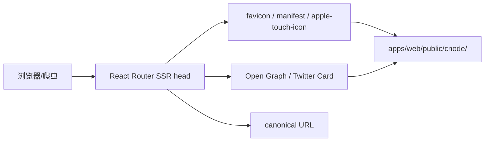
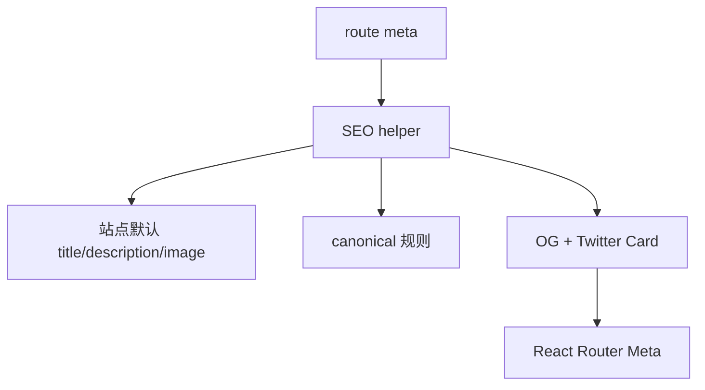

## Context

当前 `apps/web/public/` 直接放置 `cnodejs.svg`、`cnodejs_light.svg` 和 `favicon.png`，没有独立的 CNode 品牌资源目录，也没有 `favicon.ico`、`manifest.json`、`apple-touch-icon.png` 等浏览器和移动端会默认探测的资源。`apps/web/public/egg/` 已经展示了 Egg.js 资源的分层方式：完整 logo、icon SVG 和 favicon PNG 分开维护，可以作为 CNode 同源社区资源组织的参考。

React Router SSR 已在 `apps/web/app/root.tsx` 输出 `<Meta />`，各 route 通过 `meta` 函数产出页面标题。当前只有话题详情页输出 `og:title` 和 `og:description`，但现有 `openspec/specs/seo/spec.md` 已要求话题页、列表页、Twitter Card、JSON-LD 和 canonical；实现与规格之间存在缺口。

线上 HTTPS 首页还会渲染来自 legacy 数据的 `http://www.gravatar.com/avatar/...` 头像 URL。Chrome 会自动升级该图片请求，但仍输出 mixed content warning；这说明头像 URL 归一化需要同时覆盖 API 数据格式化和 Web 渲染兜底。

## Goals / Non-Goals

**Goals:**

- 建立 `apps/web/public/cnode/` 作为 CNode 品牌资源的公开目录。
- 基于现有 CNode SVG 抽取/派生适合小尺寸显示的 icon 和 favicon 资源。
- 补齐根路径 fallback，避免常见 favicon、manifest 和 apple touch icon 请求 404。
- 让首页、列表页、话题详情页、用户页和通用内容页输出稳定 OG、Twitter Card、canonical 和 manifest link。
- 让话题页分享内容优先使用话题数据，缺失图片时使用默认 CNode OG 图。
- 确保公开 HTTPS 页面不输出 `http://` 头像或元数据图片子资源。

**Non-Goals:**

- 不修改 `apps/web/public/egg/` 资源。
- 不修改 `CNodeLogo` 的导航呈现或现有 `/cnodejs.svg`、`/cnodejs_light.svg` 字标调用。
- 不实现动态图片服务、截图式分享图或第三方图片处理。
- 不引入 Service Worker、离线缓存、push、安装提示等 PWA 能力。
- 不调整数据库、API 数据模型、认证、权限或 legacy `nodeclub/` 运行方式。

## Decisions

### Decision: CNode 资源集中到 `apps/web/public/cnode/`

公开资源使用以下稳定路径：

| 路径 | 用途 |
| --- | --- |
| `/cnode/logo.svg` | 完整深色 CNode 字标 |
| `/cnode/logo-light.svg` | 完整浅色 CNode 字标 |
| `/cnode/icon.svg` | 小尺寸 CNode 图标源文件 |
| `/cnode/favicon.svg` | SVG favicon |
| `/cnode/favicon.png` | PNG favicon，至少 48x48 |
| `/cnode/favicon.ico` | 兼容浏览器默认探测 |
| `/cnode/apple-touch-icon.png` | iOS bookmark 图标 |
| `/cnode/icon-192.png` | manifest icon |
| `/cnode/icon-512.png` | manifest icon |
| `/cnode/og.png` | 默认社交分享图 |

根路径 `/favicon.ico`、`/favicon.png`、`/apple-touch-icon.png` 和 `/manifest.json` 继续存在，作为浏览器默认探测和旧链接兼容入口。

`/cnode/logo.svg`、`/cnode/icon.svg` 及其栅格派生资源只服务 favicon、manifest、Apple icon 和 OG 等站外/系统元数据。Header、Admin 和认证页面的 `CNodeLogo` 继续使用 `/cnodejs.svg` 与 `/cnodejs_light.svg`，避免本次元数据变更改变站内导航品牌呈现。

Rejected alternatives:

- 只保留根目录资源：路径少，但继续让品牌资源散落，后续难以区分 logo、favicon、OG 图的用途。
- 把 manifest 放进 `/cnode/manifest.json`：目录更整齐，但浏览器和工具默认探测 `/manifest.json`，会继续产生根路径 404 或需要额外声明兼容。

### Decision: favicon 沿用 Egg logo 几何结构并替换为 CNode 配色

实现应以 `apps/web/public/egg/logo.svg` 的路径、polygon、比例和渐变结构为基础，不改动几何轮廓，仅将活跃渐变与辅助线颜色替换为 CNode 品牌绿 `#80bd01` 派生色。CNode 与 Egg.js 同属 CNode group 维护，这种处理建立同源社区视觉家族，同时通过颜色区分品牌。

Rejected alternatives:

- 从旧 `cnodejs.svg` 强行裁切左侧 “C” path：原 path 为横向字标的一部分，小尺寸方形裁切后比例和负空间不成立。
- 重新设计另一套 CNode 图形：会失去 CNode/Egg 同源社区的视觉联系，并扩大本次元数据修复范围。

### Decision: manifest 表达站点身份而非安装型 PWA

`manifest.json` 应包含 `name`、`short_name`、`description`、`start_url`、`scope`、`display`、`background_color`、`theme_color` 和 icons。`display` 使用 `browser`，不声明离线能力或安装型体验。

Rejected alternatives:

- `display: standalone`：会暗示 PWA 安装体验，但项目没有 Service Worker、离线策略或独立应用导航设计。
- 不提供 manifest：会保留 `/manifest.json` 404，并让移动端收藏和爬虫无法获得一致图标信息。

### Decision: 用共享 SEO 元数据生成规则减少 route 漂移

实现可在 `apps/web/app/lib/` 提供轻量 helper，集中生成默认站点 metadata、canonical URL、OG/Twitter 字段、摘要清洗和绝对 URL。Route `meta` 函数只传入页面类型、标题、描述、路径、图片和内容数据。

Rejected alternatives:

- 每个 route 手写完整 meta 数组：实现快，但容易遗漏 `og:url`、`twitter:image` 或 canonical，且后续路径变更难维护。
- 在 root 里硬编码全部 meta：能覆盖默认页，但无法根据话题、用户等 loader data 输出页面特化内容。

### Decision: 默认 OG 图先使用静态品牌图

本次提供 `/cnode/og.png` 作为默认分享图。话题页可以从 Markdown 中提取首张图片作为 `og:image`；无法提取或图片不适合使用时回退到默认图。

Rejected alternatives:

- 动态生成每个话题的 OG 图：分享体验更好，但需要额外渲染/缓存/字体/图片管线，不适合与 favicon/manifest 基础修复绑定。
- 只用 logo SVG 作为 `og:image`：部分社交平台对 SVG 支持不稳定，PNG 默认图更可靠。

### Decision: 头像 URL 在 API 和 Web 双层归一化

`apps/api/src/lib/format.ts` 的 `normalizeAvatarUrl` 应将 Gravatar HTTP URL 升级为 HTTPS，降低 SSR HTML 和 API 响应携带 mixed content URL 的概率。`apps/web/app/lib/brand.ts` 的 `getAvatarUrl` 继续作为渲染兜底，对透传到 Web 的 `http://gravatar.com` 和 `http://www.gravatar.com` 也执行 HTTPS 升级。

Rejected alternatives:

- 只在浏览器端依赖 Chrome 自动升级：页面仍有 console warning，且不同浏览器/爬虫行为不一致。
- 对所有 `http://` 图片无条件升级：可能破坏不支持 HTTPS 的第三方头像源；本次先对已确认支持 HTTPS 的 Gravatar 做确定性升级，后续可基于数据审计扩大范围。
- 在数据库中批量修复历史头像 URL：需要数据变更审计和回滚策略，本次通过格式化层兼容 legacy 数据即可消除页面告警。

## Risks / Trade-offs

- [Risk] 社交平台缓存旧 OG 图或旧 favicon → Mitigation: 使用稳定新路径 `/cnode/og.png`，必要时通过平台 debugger 刷新缓存。
- [Risk] React Router `meta` 输出重复或覆盖顺序不符合预期 → Mitigation: helper 返回完整数组，route 级 meta 不再混合手写重复字段。
- [Risk] Markdown 摘要包含格式符号、HTML 或过长内容 → Mitigation: 对话题内容做纯文本摘要清洗并限制长度。
- [Risk] 根路径 favicon fallback 与新 `/cnode/` 路径不同步 → Mitigation: 生成资源时以同一源图派生，并在任务中验证根路径和 `/cnode/` 路径均可访问。
- [Risk] PNG/ICO 生成依赖本地工具差异 → Mitigation: 使用仓库已有可用工具或明确记录生成命令，提交最终二进制资源而不是依赖运行时生成。
- [Risk] 头像 URL 归一化影响非 Gravatar HTTP 图片 → Mitigation: 首次实现仅升级 Gravatar 域名，保留其它绝对 URL 的现有行为。

## Migration Plan

1. 新增 CNode 品牌资源到 `apps/web/public/cnode/`，同时保留根路径 fallback 文件。
2. 新增或更新 `manifest.json`，引用 `/cnode/icon-192.png` 和 `/cnode/icon-512.png`。
3. 更新 root head links：favicon SVG/ICO、apple touch icon、manifest 和默认 theme-color。
4. 更新 API 和 Web 头像 URL 归一化逻辑，消除 Gravatar mixed content warning。
5. 引入共享 SEO helper，并逐步更新首页、话题详情、用户页和列表页 meta。
6. 验证构建产物中 public 资源被复制，并通过本地或预览环境请求关键路径。
7. 如发现分享预览异常，可回滚 head link/meta 变更，保留静态资源不影响应用运行。

## Database Change Audit

本变更不涉及 PostgreSQL schema、Drizzle migration、seed/bootstrap、index、constraint、backfill、数据修复、数据清理、数据保留或字段语义变更。

## Open Questions

- `/cnode/og.png` 是否采用纯品牌默认图，还是包含“Node.js 专业中文社区”文案？
- `og:image` 是否允许使用用户头像作为用户页分享图，还是所有用户页先统一使用默认 CNode OG 图？
- 根路径 `/favicon.png` 是否长期保留，还是在若干发布后只保留 `/favicon.ico` 与 `/cnode/favicon.*`？
