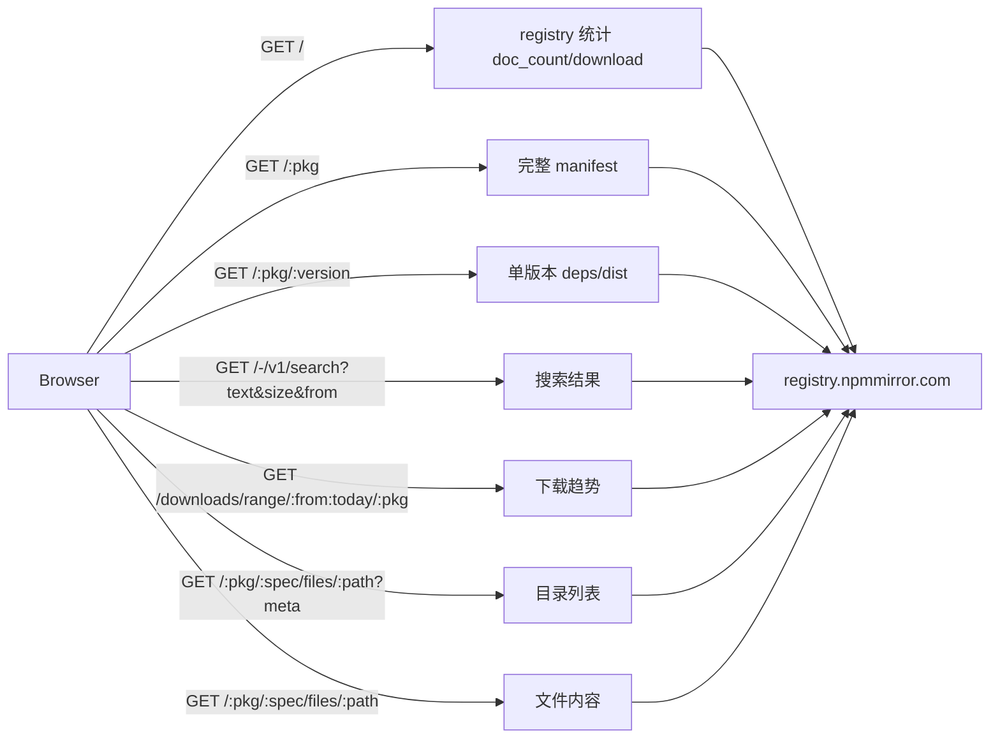
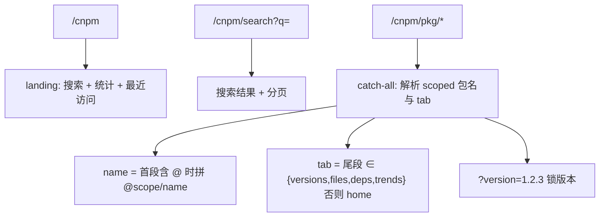

# cnpm-registry-browser 设计

## Context

cnode-next 的 web 应用（`apps/web`）基于 React Router v7 SSR + Tailwind v4 + shadcn/ui，部署在 Cloudflare Workers（`@cloudflare/vite-plugin`），已具备 KV 缓存、next-themes 深色模式、`react-markdown`（+ `rehype-highlight`）与 `highlight.js`。

上游参考 `cnpm/cnpmweb`（`~/gpm/github.com/cnpm/cnpmweb`）是一个独立 Next.js 13 + antd5 + swr 的静态应用，直接浏览器直连 `https://registry.npmmirror.com` 的 JSON API。本设计在其功能与数据端点基础上，原生重写进 cnode-next 的现有栈，视觉偏工具属性、参考 npmx.dev 的简约风格。

**registry JSON API（已验证，CORS 开放）：**



## Goals / Non-Goals

**Goals:**

- 在现有 `Layout` 内提供 `/cnpm/*` 包搜索与浏览能力，复用 cnode 的 Header/Footer 与主题。
- 不引入 antd/Next.js/swr/chart.js 等上游依赖；仅新增 `recharts`。
- 保持零后端改动（直连 registry）与零部署拓扑变化（与 web 同 Worker）。
- 预留下载趋势能力（路由 + 数据 hook + 基础图）。

**Non-Goals:**

- 不做发布、账号、用户主页、npa 重定向、广告、README 图片代理、⌘K 集成、trends 富交互。
- 不通过 `apps/api` 代理 registry 请求。

## Decisions

### D1: 原生重写而非引入 cnpmweb 或 iframe

- **选择**：在 `apps/web` 内新增 `/cnpm/*` 路由组，原生重写。
- **备选**：a) 将 cnpmweb（Next.js 静态站）作为独立应用引入 monorepo —— 引入第二套前端栈与主题体系，部署复杂，与"简约"冲突；b) iframe 嵌入 `npmmirror.com` —— 零成本但体验割裂、主题不统一。
- **理由**：重写能复用现有设计系统（Tailwind + shadcn + next-themes）、部署拓扑（同一 Worker）与既有依赖（react-markdown、highlight.js），且可按需裁剪（去广告）。cnpmweb 仅作端点与交互参考，不 vendor 代码。

### D2: 浏览器直连 registry，不做服务端代理

- **选择**：客户端直接 fetch `https://registry.npmmirror.com`。
- **备选**：web 路由 loader 服务端代理 + KV 缓存 —— SEO/首屏更好，但需新增代理层与缓存策略；`apps/api` 代理 —— 增加后端链路与限流依赖。
- **理由**：cnpmweb 已按此方式线上运行多年，CORS 实测开放（回显 Origin）；直连实现最简单，符合"工具页"定位。风险是匿名浏览器限流，接受之（见 Risks）。

### D3: URL 结构 `/cnpm/*` 前缀 + catch-all 解析 scoped 包



- **选择**：`/cnpm` 前缀隔离社区路由；`route("cnpm/pkg/*")` 用 catch-all 参数解析（`@scope/name` 需多段，`cnpm/pkg/:name` 无法表达）；版本用查询参数 `?version=`（同 cnpmweb），tab 为尾段。
- **备选**：npmx.dev 的 `/v/:version` 路径分段 —— SEO 更好但 URL 更复杂；`?tab=` 查询参数 —— 与导航语义不符。

### D4: 图表用 shadcn Chart（recharts）

- **选择**：`shadcn add chart` 生成 `ui/chart.tsx`，底层 recharts。
- **备选**：chart.js + react-chartjs-2（上游同款，`chart.js/auto` 约 250KB）；手写 SVG（零依赖但 tooltip/坐标轴成本高）。
- **理由**：项目已接入 shadcn 组件体系（components.json 存在），组件形态与现有 `ui/*` 一致；recharts 声明式、便于后续做多包对比；本次仅做基础下载图，富交互留后续。

### D5: 复用现有渲染依赖

- README 用现有 `react-markdown` + `rehype-highlight` + `remark-gfm`（`apps/web/app/components/MarkdownView.tsx` 已有同类实现，可抽出或仿写）。
- 文件预览代码高亮用现有 `highlight.js`（`MarkdownView` 已依赖）。
- 深色模式由 next-themes + Tailwind 变量自动继承，无需独立切换。

### D6: 文件树懒加载

- 目录列表请求 `/:pkg/:spec/files/:path?meta` 逐级按需加载（cnpmcore issue #680 教训：一次请求全量存在性能问题）；关闭自动 revalidate，避免大量重复请求。
- 选中文件路径写入 URL（query 或 path），支持分享/刷新还原。

### D7: 导航硬编码 + 最近访问 localStorage

- CNPM 菜单项在 `Layout.tsx` 硬编码（桌面 nav 与移动 sheet），与 API/关于 同级，不改 DB。
- landing 最近访问列表用 localStorage 维护（去重、置顶、可删），与 cnpmweb 的 `useRecent` 行为一致。

### D8: 代码组织

```
apps/web/app/
  routes/cnpm.tsx              # /cnpm landing
  routes/cnpm.search.tsx       # /cnpm/search
  routes/cnpm.pkg.tsx          # /cnpm/pkg/* catch-all
  lib/registry/types.ts        # Manifest / Version / Search / Files / Downloads 类型
  lib/registry/client.ts       # fetch 封装 + REGISTRY 常量 + 名称/tab/版本解析纯函数
  components/cnpm/             # SearchBox / PackageHeader / VersionTable /
                               # FileTree / DepsTable / DownloadChart / RegistryStats …
```

## Risks / Trade-offs

- [registry 对匿名浏览器限流] → cnpmweb 已按直连方式线上运行多年，风险低；若出现可在后续引入 Worker 代理 + KV 缓存（本轮不做）。
- [文件页大量小请求] → 目录树逐级懒加载、关闭 revalidate，规避 cnpmcore #680 性能问题。
- [README 相对路径图片可能裂图] → 不做图片代理（Non-goals），绝对 URL 图片正常渲染，后续可加 image proxy。
- [工具页宽度受 `PageContainer` 约束] → 与站点视觉统一优先，必要时可对 `/cnpm/*` 放宽容器宽度。

## Migration Plan

- 无数据库迁移、无 `packages/db`/`apps/api`/`packages/shared` 变更。
- 部署为 web Worker 的一部分，随 `apps/web` 正常发布；回滚即回退 web 版本。
- 新增依赖 `recharts` 需在 pnpm-lock.yaml 中落实（`shadcn add chart` 自动处理）。
