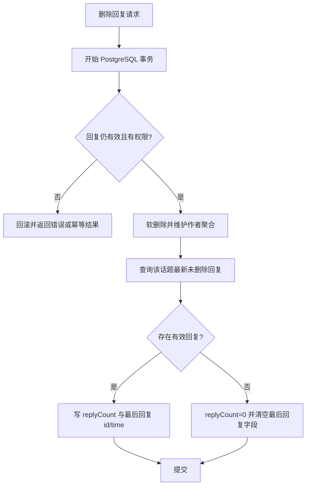

## Context

本 change 汇总了生产页面调查中确认的八类问题。数据侧，`replyQueries.getByTopicId()` 没有 `orderBy`，PostgreSQL 返回顺序不能作为楼层依据；回复删除只软删除并递减计数，没有维护 `topics.lastReplyId/lastReplyAt`，已经出现 `reply_count=0`、`replies=[]` 但仍显示最后回复时间的记录。消息 API 默认 `mdrender=true`，而 `/my/messages` 的两个分组共用 `MessageItem` 并把 `reply.content` 当文本节点输出。

展示侧，topic reading grid 在 `xl` 从单列直接变为固定双侧栏与正文，可能过度压缩正文；失效外链图片保留浏览器破图；About 的六个模块被包进单一大 Card；首页 sidebar Card 间距不足；CommandPalette 的自定义关闭按钮与搜索输入重叠。

legacy `../nodeclub/` 和 `egg-cnode/` 只作为线性回复、消息 API 与删除语义参考，不修改、不构建，也不引入 MongoDB 兼容路径。运行数据库保持 PostgreSQL only。

## Goals / Non-Goals

**Goals:**

- 让回复排序、楼层、回复计数和最后回复元数据来自同一稳定有效回复集合。
- 同时修复删除流程和已经存在的 PostgreSQL 不一致数据。
- 让新消息和过往消息使用一致的纯文本摘要，而不改变公共 API 的 `mdrender` 契约。
- 消除已确认的正文宽度跳变、破图、内容密度、sidebar 节奏和 CommandPalette 覆盖问题。
- 在 375px、768px、1280px、1440px viewport 验证相关页面。

**Non-Goals:**

- 不恢复、代理或归档当前不可访问的外部图片。
- 不改变线性回复模型、消息类型、权限矩阵或首页模块顺序。
- 不新增数据库字段、SQLite 路径或运行时依赖。
- 不重写全站布局或处理调查范围之外的样式。

## Decisions

### 1. 回复使用数据库显式稳定排序

`getByTopicId` 按 `replies.createAt ASC, replies.id ASC` 查询未删除回复，API 保留该顺序，Web 直接按数组索引生成楼层。选择数据库排序而不是前端排序，因为 API 客户端、引用和 Web 必须共享同一顺序；`id` 作为次级条件处理迁移数据时间戳相同的情况。

拒绝依赖 PostgreSQL 物理顺序，因为无 `ORDER BY` 没有顺序保证；拒绝只按 `id`，因为迁移 ID 与真实创建时间不保证一致。

### 2. 回复删除与话题聚合在事务内维护

删除流程在单个 Drizzle/PostgreSQL 事务中完成：锁定或重新读取目标回复、拒绝重复副作用、软删除、维护作者计分/回复数、查询该话题最新未删除回复，并写入精确 `replyCount`、`lastReplyId`、`lastReplyAt`。若没有有效回复，最后回复字段写 null。话题列表活动排序使用 `coalesce(lastReplyAt, createAt)` 并显式控制 null 语义，避免无回复话题因 PostgreSQL `DESC` null 顺序被提升。

拒绝只在被删 ID 等于 `lastReplyId` 时做局部更新，因为存量数据本身可能已经不一致；拒绝异步修复，因为用户会在窗口期继续看到错误状态。

### 3. 使用幂等 PostgreSQL 数据修复回算话题回复聚合

提供显式运维脚本，从 `deleted=false` 的回复按 `createAt DESC, id DESC` 回算全部或指定范围 topics 的 `replyCount`、`lastReplyId`、`lastReplyAt`。脚本支持 dry-run/统计输出但不得打印用户内容或数据库 URL；执行后核验不一致记录为 0。修复不调整用户 score/reply_count，避免在缺少完整历史操作日志时推断用户账本。

### 4. Web 消息页请求原始 Markdown并生成纯文本摘要

`/my/messages` loader 使用 `mdrender=false`，并在 Web/shared 的纯函数边界把 Markdown、链接、代码和允许的原始 HTML 转为长度受限的纯文本摘要。新消息与过往消息继续共用 `MessageItem`，因此标记已读后的展示不变。公共 `/api/v1/messages` 默认值及显式 `mdrender=true` 返回保持不变。

拒绝 `dangerouslySetInnerHTML`，因为通知列表不需要完整富文本且会扩大安全边界；拒绝修改公共 API 默认值，避免破坏 legacy-compatible 客户端。

### 5. TOC 改为正文顶部原生 disclosure

移除 `ReadingGrid` 的左侧 TOC 列，reading layout 固定为主内容 + 右侧上下文。至少四个 h2/h3 时，在正文开始处渲染默认折叠的语义化 disclosure，继续复用现有 heading extraction 和 anchors；移动端点击目录项后收起。

拒绝彻底删除 TOC，因为长文仍需要章节导航；拒绝扩大全站容器来容纳三列，因为这不能解决 1280px 断点骤缩，并会破坏 shell 对齐。

### 6. Markdown 图片由状态组件提供客户端降级

`MarkdownView` 的 `img` renderer 委托给小型图片组件：初始 SSR 输出正常 lazy ``；客户端 `onError` 后渲染紧凑失败卡片；重试只重置当前图片一次加载周期；原图链接使用安全外链属性。renderer 显式移除 `node` 等 AST 属性。失败卡片作为文本 UI 输出，不使用未净化 HTML。

拒绝图片代理，因为当前源站主动断开时代理也不能恢复内容，并会引入 SSRF、流量与缓存治理；拒绝大型固定比例占位，因为连续十张失效图片会制造更严重的空白。

### 7. About、首页 sidebar 与 CommandPalette 使用局部布局修正

- About 保留 marketing header 和页内导航，移除“社区手册”总 Card；主内容以独立 sections 排列，桌面 64px、移动端 48px block gap，内部重复项至少 16px。
- Sidebar 顶层容器桌面使用 24px gap、移动端至少 20px，Card 内部 `size="sm"` 密度和模块顺序不变。
- CommandPalette 搜索输入和关闭 Button 放入显式搜索行，关闭控件占独立布局空间并复用 Dialog/Base UI 关闭语义，不再绝对覆盖输入；保留 Escape 与 `finalFocus`。

实现阶段使用项目包管理器运行 shadcn CLI 的 `info` 与 `docs dialog command input-group button`，确认项目为 Base UI、上述组件均已安装。当前 composition 保留 `CommandInput` 内部既有 `InputGroup`，在其外层搜索行使用 `DialogClose render={<Button />}` 分配独立关闭空间；不运行 `add --overwrite`，避免覆盖本地 `dialog.tsx`、`command.tsx` 和 `input-group.tsx` 定制。

拒绝全局修改 Card spacing，因为会影响数十个无关页面；拒绝移除 CommandPalette 关闭按钮，因为移动端不能只依赖 Escape。

## Database Change Audit

| 项目 | 结论 |
|---|---|
| Schema / Drizzle migration | 不新增或修改字段；为有效回复聚合与稳定排序增加 reviewed partial index migration |
| 字段语义 | `last_reply_id/at` 明确指向最后一条未删除回复；无有效回复时为 null |
| 查询/index | 现有 schema 无回复 topic 索引；增加 `(topic_id, create_at, id) where deleted=false` partial index。部署前后仍需在真实 PostgreSQL 运行 `EXPLAIN` 核验 |
| Backfill / repair | 新增幂等 PostgreSQL 修复脚本，回算 topic 回复聚合 |
| Seed/bootstrap | 不修改 |
| 数据清理/保留 | 不删除回复记录，仅修复聚合字段 |
| 核验 | 修复前后统计不一致 topic 数，抽查 `49278` 类零回复记录与多回复回退记录 |

隔离 PostgreSQL 18 克隆验证使用 231,109 条回复：索引前 count/latest 查询采用 Parallel Seq Scan，执行约 39–51ms；应用 `replies_active_topic_order_idx` 后采用 Index Only Scan，执行约 0.12–0.38ms。migration 重复执行安全，repair 首次修复 48,972 个 topic，随后 dry-run 与第二次 apply 均为 0；用户数量、总积分、用户回复数和回复删除状态计数保持不变。

## Risks / Trade-offs

- [删除事务涉及多个聚合更新，可能产生锁竞争] → 仅锁定目标 reply/topic，保持事务短小，并增加并发删除测试。
- [存量 repair 可能改变首页话题活动排序] → dry-run 输出计数，先备份相关 topic 聚合字段，分批执行并核验。
- [Markdown 摘要规则可能丢失格式信息] → 通知只承诺纯文本摘要，完整内容通过 topic/reply 链接查看。
- [图片 onError 只在 hydration 后生效] → SSR 保持标准 img 和 alt；客户端加载失败后立即降级，不为失败图增加服务端探测。
- [About 去掉外层 Card 后可能削弱视觉边界] → 使用 section rhythm、内部 Item/Card 和现有语义 token，不新增装饰性颜色系统。
- [TOC 默认折叠降低可发现性] → summary 显示“目录 · N 个章节”，仅对足够长的文章出现。

## Migration Plan

1. 先发布稳定查询、删除事务与测试，但暂不执行存量修复。
2. 部署 Web 的消息、TOC、图片和布局变更，并完成固定 viewport 回归。
3. 在生产 PostgreSQL 对 repair 运行 dry-run，保存聚合字段备份和差异统计。
4. 执行幂等 repair，核验零回复、删除最新回复和普通多回复话题。
5. 观察首页排序、API 错误和删除操作日志；异常时回滚应用版本，并从备份恢复 topic 聚合字段。Web 视觉变更可独立回滚，不影响数据。

## Open Questions

无。现有 schema 已确认缺少该访问模式的索引，因此纳入 reviewed migration；真实数据上的 `EXPLAIN` 仍是部署门禁。
