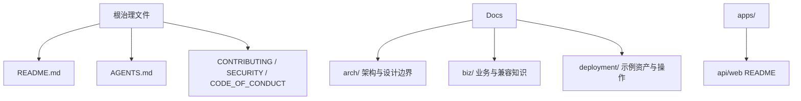
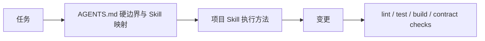

## Context

仓库当前将长期信息拆分到根治理文件、`docs/`、`wiki/`、`api/` 和 `deployment/`。这一结构经过多次整理后形成了重复职责：`docs/conventions.md`、`AGENTS.md` 与 `CONTRIBUTING.md` 重叠；`docs/security.md` 与 `SECURITY.md` 重叠；业务知识大量复述路由、schema 和函数；部署目录同时包含文档、示例资产、可执行辅助脚本和运行输出目录。

本变更不修改 legacy `../nodeclub/` 兼容行为或当前应用行为，而是重新定义长期知识、可执行示例和 Agent 操作规范的归属。迁移必须保持 `/api` 页面、`pnpm gen:openapi`、部署辅助命令和 Compose 操作可用。

## Goals / Non-Goals

**Goals:**

- 建立三个无索引页的文档域：`docs/arch/`、`docs/biz/`、`docs/deployment/`。
- 以单一权威来源为依据精简内容，删除源码镜像、重复规则、一次性过程和过时说明。
- 用 `AGENTS.md`、项目级 Skills 与自动化门禁形成“硬边界、执行方法、机器校验”三层治理。
- 保持 OpenAPI Web 展示、部署命令、OpenSpec 与仓库链接在路径迁移后有效。
- 将 GitHub Issue/PR 模板缩减为维护者真正需要且无法自动推导的信息。

**Non-Goals:**

- 不改变 API、数据库、权限、业务规则、生产部署语义或 legacy 兼容范围。
- 不新增文档站点、文档生成器、根文档索引或目录级 README。
- 不重写 archived changes 或 Git 历史。
- 不把所有自然语言规范实现成脆弱的固定文本检查。

## Decisions

### 1. 长期文档统一进入三个分类

`docs/arch/` 只承载跨模块、数据和设计系统的稳定决策；`docs/biz/` 只承载影响用户行为、数据一致性或兼容决策的知识；`docs/deployment/` 承载可公开的示例配置、Compose、操作说明和辅助脚本。生成的 OAS 是 Web 发布资产，不作为长期文档域。`wiki/`、顶层 `api/` 与顶层 `deployment/` 在迁移完成后删除。

不建立 `docs/README.md`、`docs/index.md` 或子目录索引页。根 README 只提供项目入口和少量直接链接，不恢复完整目录清单。

**拒绝方案：**保留 `docs/`、`wiki/`、`deployment/` 三个同级域。该方案延续当前“任务文档与知识文档如何区分”的维护成本，且不满足统一进入 `docs/` 的目标。严格只保留 `api/biz/deployment` 也被拒绝，因为架构和设计决策无法准确归入这些分类。

### 2. 内容按权威来源精简，而非原样移动

| 信息 | 权威来源 | 文档保留范围 |
| --- | --- | --- |
| API 字段与端点 | route zod-openapi 声明 | 生成到 `apps/web/public/openapi.json` 并由 `/api` 展示 |
| 数据库字段 | Drizzle schema 与 migration | 只记录架构边界和迁移原则 |
| 命令 | workspace `package.json` | README 只列完成任务需要的命令 |
| 当前实现 | 源码与测试 | 不逐函数复述 |
| 业务语义 | `docs/biz/` 及来源 | 稳定规则、兼容原因、待确认事项 |
| 架构决策 | `docs/arch/` | 跨模块边界、原则和关键流程 |

每份文档必须有单一目的和受众。迁移时逐份执行“保留、压缩、合并、删除”，而不是保留旧结构的全部段落。`docs/biz/` 中的事实引用源码或已接受规格；不确定信息使用 `To Confirm`，不强制填充 `Facts`、`Inferences`、`Review Status` 等模板章节。

**拒绝方案：**只修改路径和链接。该方案会保留重复、过时和源码镜像问题，无法达到简化目标。

### 3. AGENTS、Skills 与门禁分层

`AGENTS.md` 保留项目事实、不可违反的边界、常用验证命令以及任务到 Skill 的加载映射。详细文档操作规范进入 `.agents/skills/cnode-docs/SKILL.md`；详细 Web 设计执行规范进入 `.agents/skills/cnode-web-design/SKILL.md`。`docs/arch/design-system.md` 面向开发者解释稳定设计决策，不承担 Agent 操作清单。

`cnode-docs` 在创建、编辑、移动、审查或删除文档、治理文件、应用 README、OpenAPI 输出、部署示例和 GitHub 模板前加载。`cnode-web-design` 在修改 Web layout、route composition、component、theme、responsive 或 Markdown presentation 前加载。

**拒绝方案：**把全部规范继续放在 `AGENTS.md`，会增加常驻上下文并弱化重点；把全部规范移入 Skills，也会因 Skill 未加载而失去硬边界。

### 4. OpenAPI 只保留 Web 发布输出

`apps/api/src/routes/*.ts` 仍是契约源。`pnpm gen:openapi` 只生成 `apps/web/public/openapi.json`，供 `/api` 页面通过 `/openapi.json` 加载。仓库不额外维护一个无人直接阅读的文档副本。

**拒绝方案：**同时保留 `docs/api/openapi.json` 和 Web public 副本会增加无实际读者收益的重复产物；只保留 `docs/api/openapi.json` 并让浏览器读取仓库路径则会破坏 Web 静态资源边界。

### 5. 部署资产整体迁移但不保留运行输出

`deployment/README.md` 政名为 `docs/deployment/deployment.md`，示例 dotenv 使用非隐藏的 `env.production.example`，Compose 与辅助脚本迁入同一文档域。根 `package.json` 和所有引用同步新路径。`migration-reports/` 等运行输出不作为文档迁移；Compose 需要输出报告时使用显式的外部或忽略路径变量，避免在版本化文档目录产生运行数据。

部署内容继续保留 reviewed migration、备份、health、smoke 和 rollback 约束，但删除环境特定信息和重复检查表。配置仅使用 `example.com`、`${ENV_VAR}`、`<secret>` 等占位内容。

**拒绝方案：**把可执行辅助脚本留在顶层 `deployment/`。这会保留第二部署域并使“文档全部位于 docs”产生歧义。

### 6. 根文件、应用 README 与 GitHub 模板采用最小职责

根 README 只说明项目、技术栈、快速开始和治理入口；应用特定职责与命令分别进入 `apps/api/README.md`、`apps/web/README.md`。贡献流程放在 `CONTRIBUTING.md`，安全报告放在 `SECURITY.md`，Agent 规则放在 `AGENTS.md`，不相互复制长段内容。

Bug Issue 只收集 Description、Reproduction、Additional context；Feature Issue 只收集 Problem、Proposal；PR 只收集 Summary、Verification、Notes。`config.yml` 仅保留私密安全报告入口。影响分类、OpenSpec 解释和 secret 确认不再作为模板复选清单，交由贡献规范、review 与 CI 负责。

## Risks / Trade-offs

- [旧路径被外部脚本引用] → 在仓库内全量更新引用并把路径变更标为 breaking；仓库外消费者需迁移。
- [Compose 移动改变相对路径解析] → 明确检查 volumes、env file 和执行工作目录，并在部署 preflight 运行 `docker compose ... config`，但不纳入普通本地 `pnpm verify`。
- [内容精简误删重要知识] → 按权威来源矩阵审计；业务语义和兼容原因优先保留，纯实现细节通过源码引用替代。
- [Skill 未自动加载] → `AGENTS.md` 保留显式触发映射和硬边界；可机器判断的规则继续由现有测试或通用检查覆盖。
- [OpenAPI 生成产物漂移] → `pnpm verify` 运行单一生成命令，并由版本控制显示未提交差异。
- [文档域中包含可执行脚本令人意外] → `docs/deployment/` 明确是部署示例资产域，不只是 Markdown 目录；应用运行源码仍留在 `apps/`、`packages/`、根 `scripts/`。

## Migration Plan

1. 先建立目标目录、应用 README 和 Skills，再迁移内容，避免中间阶段丢失职责。
2. 更新生成器、根命令和部署相对路径后，删除旧 `wiki/`、`api/`、`deployment/` 与被合并的文档。
3. 搜索并修正当前源码、配置、主规格和非 archive 文档中的旧路径；archive 保持历史语义，除非包含不安全数据。
4. 运行 OpenAPI 生成、相关 package 验证、`pnpm verify`、OpenSpec strict validation 与 secret scan。Compose 解析作为部署 preflight 单独执行。

回滚方式是恢复迁移前路径及对应命令引用；本变更无数据迁移或运行时状态，回滚不涉及数据库。

## Open Questions

- 无。目录分类、无索引页、模板最小字段和两个项目级 Skills 已在探索阶段确认。
