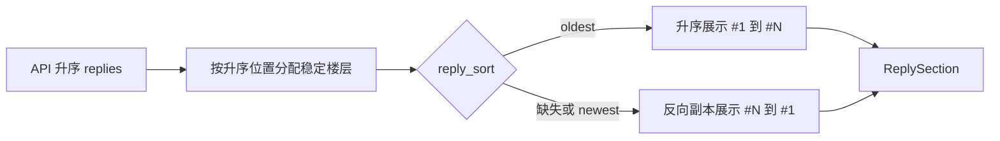
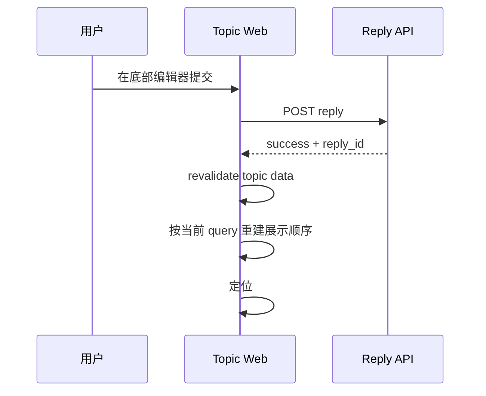

## Context

`GET /api/v1/topic/{topic_id}` 当前通过 `buildRepliesByTopicQuery` 按 `replies.createAt ASC, replies.id ASC` 返回全部未删除回复。`apps/web/app/routes/topic.$tid.tsx` 的 loader 缓存该规范 payload，`ReplySection` 再以数组索引生成楼层。这个顺序同时服务 legacy-compatible API、楼层和引用锚点，但固定升序使长讨论的最新进展位于页面底部。

本变更只调整 topic detail reading route 的展示顺序。公共 API、数据库查询、线性回复模型和匿名 KV payload 保持不变。

## Goals / Non-Goals

**Goals:**

- 默认让用户先看到最新回复，并能显式切换为最早优先。
- 保持楼层、引用 ID、公共 API 和缓存数据的规范时间线不变。
- 让 SSR、URL、客户端导航与无 JavaScript 首屏采用同一排序结果。
- 回复提交成功后把用户带到新回复，而不是留在底部编辑器。

**Non-Goals:**

- 不增加回复分页、热门排序、嵌套树或永久偏好。
- 不修改 API schema、Drizzle schema、migration、索引或 Redis/KV 拓扑。
- 不修改 `../nodeclub/` 或 `egg-cnode/`。

## Decisions

### 1. 分离规范时间线、楼层和展示顺序

loader 获取 API 的升序回复后，先按规范数组位置关联 `floor = index + 1`，再为“最新优先”创建反向展示副本；“最早优先”保持原顺序。不得原地 `reverse()` 缓存对象，也不得使用 CSS `column-reverse`。

选择 Web 数据塑形而不是修改 API，是因为当前 API 一次返回全部回复，前端反向不会增加查询成本，并能保留既有客户端契约。拒绝直接修改 `buildRepliesByTopicQuery` 为倒序，因为这会改变公共 API 和楼层依据；拒绝在 `ReplyItem` 中使用展示数组下标，因为倒序后会把最新回复错误标为 `#1`。

### 2. URL query 是当前页面排序状态的唯一来源

使用 `reply_sort=oldest` 表示非默认排序；query 缺失、`newest` 或无效值均按“最新优先”处理。默认状态不强制重定向或写入 URL。切换控件更新当前 URL 并保留与话题页兼容的其他 query，React Router 重新执行 loader，使 SSR 和客户端结果一致。

拒绝组件本地 state 作为唯一来源，因为刷新、分享和浏览器历史会丢失选择；拒绝 `localStorage`，因为它会造成 SSR 首屏与 hydration 后排序跳变；拒绝账号或 Redis 持久化，因为该偏好不需要跨页面或跨设备保存。

### 3. 复用现有紧凑表单控件并保持 DOM 阅读顺序

排序控件放在回复区标题行，使用项目现有 Base UI/shadcn `Select` 和语义 theme roles，标签为“回复排序方式”，选项为“最新优先”和“最早优先”。窄屏允许标题与控件换行，不制造横向滚动；回复 DOM 顺序必须等于视觉顺序，保证键盘和屏幕阅读器按用户选择的方向阅读。

拒绝 `NativeSelect`，因为详情阅读区的显式选择动作应与项目 Base UI popup、键盘和焦点行为一致；拒绝新建全局排序组件，因为当前只有一个消费点；若后续出现第二个一致用例再抽取。拒绝仅用图标或“正序/倒序”，因为它们没有直接表达排序依据。

### 4. 小屏 action surface 保持左右动作分组

Topic action surface 使用两列 composition：左侧是“收藏话题、查看回复”等主互动和页内导航，右侧是作者直接编辑、普通用户举报或 mod/admin 管理入口。两列内部允许换行，右侧保持末端对齐；角色权限及 admin 编辑他人只在管理菜单中的语义不变。

拒绝小屏纵向堆叠两个均左对齐的动作组，因为它会模糊主互动与权限动作边界；拒绝复制按钮到两侧，因为会产生重复焦点和权限表达。

### 5. 提交成功后等待数据刷新并定位新回复

创建回复接口已经返回 `reply_id`。Web 成功处理保留该字段，在 revalidation 完成并渲染新列表后，将 URL hash 更新为回复 ID并滚动到对应 Card；滚动行为尊重 `prefers-reduced-motion`。toast 继续提供成功反馈。定位不得改变当前 `reply_sort` query。

拒绝只调用 revalidate，因为默认最新优先会把新回复放到远离当前滚动位置的顶部；拒绝在响应后立即滚动，因为对应 DOM 可能尚未渲染。

### 6. 公共 API 与匿名缓存保持规范升序

Web 对匿名 topic payload 的 KV key 和内容保持不变。排序只作用于 loader 返回给当前请求的派生展示数组，不能写回缓存对象。`GET /api/v1/topic/{topic_id}` 继续按 `create_at ASC, id ASC` 返回数据，OpenAPI 资产无需变化。

该选择保留 `../nodeclub/` 线性时间线兼容语义，同时只在新 Web 详情体验中改变默认阅读入口。

## Database Change Audit

| 项目 | 结论 |
| --- | --- |
| PostgreSQL schema / Drizzle migration | 不修改 |
| 字段语义 / constraint | 不修改 |
| 查询 / index | 保留 `(topic_id, create_at, id)` 有效回复升序查询与现有索引 |
| seed / bootstrap | 不修改 |
| backfill / repair / cleanup / retention | 不需要 |

## Risks / Trade-offs

- [楼层随展示数组被重新编号] → 在反向前生成 `{ reply, floor }`，并测试两种方向的同一回复楼层相同。
- [原地反转污染 KV 缓存对象] → 只创建派生副本，测试同一 payload 连续生成两种排序不会互相影响。
- [query 与 UI 状态不一致] → loader 统一解析，控件从 loader 数据受控渲染，不建立第二份本地排序状态。
- [提交后滚动早于新 DOM] → 等待 revalidation 完成，再以 API 返回的 `reply_id` 查找目标。
- [长列表反向产生额外内存] → 当前 API 已加载完整数组，派生对象开销可控；分页属于后续独立设计。
- [测试环境操作写入共享数据] → 只使用明确的非生产测试话题和测试账号，不读取、打印或记录 `.env` 值及用户内容。

## Migration Plan

1. 发布 Web loader、排序控件、楼层塑形和提交定位，并保持 API 与缓存格式不变。
2. 运行针对性 Web/API 测试、`pnpm typecheck` 和 OpenSpec strict validation。
3. 使用仓库现有 `.env` 执行 `pnpm dev`，连接已配置的测试 PostgreSQL/Redis，在桌面和移动 viewport 验证默认排序、切换、刷新、锚点与新回复定位；不得输出环境变量值。
4. 回滚时仅回退 Web 变更；没有数据库、缓存格式或 API 数据迁移需要恢复。

## Open Questions

无。跨话题偏好和回复分页如有需求，另建 change 设计。
