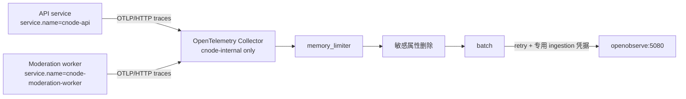

## Context

`apps/api` 是 ESM package，开发和生产容器当前均由 `tsx` 直接加载 TypeScript 入口：API 使用 `src/index.ts`，moderation worker 使用 `src/worker/moderation-scan.ts`。两个入口的静态 import 会在入口代码执行前加载 Hono、HTTP、Undici、Drizzle/PostgreSQL 等模块；若在入口内部启动 OpenTelemetry，自动 instrumentation 注册时机已经过晚。

本 change 依赖 `simplify-compose-operations` 提供 OpenObserve 基线。Collector 的实际 OTLP endpoint 与专用 ingestion token 由部署 dotenv 提供，仓库只保存安全占位。该 change 使用 `latest` 镜像，本设计不改变其选择，也不记录仓库外访问拓扑。利益相关者包括 API/worker 维护者、生产部署人员和 OpenObserve 管理员。

## Goals / Non-Goals

**Goals:**

- 在 API 和 moderation worker 中建立以 traces 为主的 OpenTelemetry MVP。
- 保证 SDK 在 Hono、HTTP、Undici 与 PostgreSQL instrumentation 目标模块之前初始化。
- 以 Collector 隔离应用和 OpenObserve，并使整个遥测链路 fail-open。
- 用 parent-based ratio sampling、低基数资源属性和双层敏感字段删除控制成本与泄露风险。
- 提供可自动验证的启动、故障、采样、安全和 Compose 契约。

**Non-Goals:**

- 不实现浏览器或 Web SSR tracing。
- 不交付完整 metrics、dashboard、alert，也不增加 Redis 自定义 span。
- 不全面替换 `console.*`；结构化日志及 `trace_id`/`span_id` 关联仅作为后续阶段。
- 不修改 OpenObserve 镜像、UI/公网入口、数据卷或 root 凭据策略。
- 不修改 PostgreSQL schema、数据、Drizzle migration、seed 或字段语义。

## Decisions

### 1. 使用显式 ESM bootstrap 动态导入业务入口

增加一个轻量 bootstrap，先导入现有 `load-env`，根据目标角色构建 tracing 配置并等待 SDK 注册完成，再以动态 `import()` 加载 API 或 moderation worker。`apps/api/package.json` 的 dev/worker scripts 与 API Docker `CMD` 都必须以 bootstrap 为入口，并通过明确参数选择角色；业务入口自身保持可测试导入。

拒绝在 `src/index.ts` 或 worker 文件顶部静态导入 telemetry：ESM 会先求值整个静态依赖图，无法保证 instrumentation 早于 Hono/Undici/PostgreSQL。拒绝仅使用 `NODE_OPTIONS=--import`：当前生产容器通过 `tsx` 执行 TypeScript 源码，Node preload 与 tsx loader 的排序和参数转发更脆弱，也容易漏掉 worker 命令。显式 bootstrap 可由测试直接验证导入顺序，并使 Docker entrypoint 影响可见。

### 2. SDK 配置为应用拥有的 fail-open 边界

API 与 worker 使用同一 telemetry 模块和 typed parser，采用 `CNODE_OTEL_ENABLED`、`CNODE_OTEL_EXPORTER_OTLP_ENDPOINT`、`CNODE_OTEL_TRACE_SAMPLE_RATIO` 等 `CNODE_*` 应用变量。默认禁用；生产示例显式启用、指向 Collector 内部 OTLP/HTTP receiver，并采用默认 `0.1` 的 root ratio。采样器为 `ParentBasedSampler(TraceIdRatioBasedSampler)`，因此上游采样决定优先于本地 root ratio。

禁用、缺少 endpoint、ratio 非有限数或超出 `[0,1]` 时，telemetry 初始化只输出不含配置值的诊断并返回 no-op；bootstrap 继续加载业务入口。SDK 启动/关闭使用有界等待，exporter 的连接失败由 SDK 异步处理，不进入请求成功条件。

拒绝让无效生产 telemetry 配置阻止启动：可观测性是辅助能力，不能成为 API/worker 单点故障。拒绝静默修正非法 ratio：明确降级更易审计，也避免意外全量采样。

### 3. 统一 instrumentation，并为 Hono 增加受控 server spans

NodeSDK 启用 HTTP、Undici 和 PostgreSQL instrumentation。当前 API 是公网信任边界，且 Web SSR tracing 不在本 change 范围内，因此不得把调用方提供的 W3C `traceparent` 作为可信 parent：每个入站 HTTP 请求由 OpenTelemetry SDK 的 ID generator 创建新的 128-bit trace ID，避免调用方控制 trace identity 或通过 sampled flag 强制采样。该 root span 以下的 Hono、HTTP、Undici 和 PostgreSQL child spans 仍共享同一 trace ID，并由 parent-based sampler 继承本地 parent 决定。未来只有在部署拓扑明确提供不可伪造的可信服务边界时，才可另行设计远程 parent 继承。Hono middleware 为每个请求创建关联 span，使用匹配后的路由模板而不是包含 ID/query 的原始 URL 命名，记录 method、route、status 与可控错误类型，并传播活动 context。API 与 worker 分别使用 `cnode-api` 和 `cnode-moderation-worker`；共同 resource attributes 至少包含 `service.version`、commit revision 与 `deployment.environment`，未知值使用稳定占位而非动态值。

API 另外为每个 Hono 请求生成独立 UUID Request ID。它不复用 trace ID，也不接受公网调用方提供的 `X-Request-ID` 作为服务端标识；成功、提前返回和错误响应都返回服务端生成的 `X-Request-ID`，不额外承诺 `X-Trace-ID` response header。该 ID 保存在 Hono context，并可作为 `cnode.request.id` 写入对应 request span，便于从用户反馈定位已采样 trace；它不得进入 resource attributes 或 metrics labels。Request ID 在 tracing 禁用或 trace 未采样时仍然生成，但本 change 不承诺每个 Request ID 都有可检索的 trace 或日志。

PostgreSQL 保留连接阶段、operation、结果状态和耗时，但禁止导出 SQL 文本、query parameters、连接串、用户名或密码。应用侧 span processor 在 export 前删除禁止属性，Collector 再做一次属性删除作为纵深防御。HTTP instrumentation 不捕获请求/响应 body，header allowlist 默认为空。

拒绝依赖 OpenObserve ingestion 端过滤：敏感数据不应离开应用/Collector 信任边界。拒绝将异常 message/stack 原样附加到 Hono span：错误文本可能包含用户正文、token 或 SQL；MVP 只记录已分类错误类型和状态。拒绝把 Request ID 与 trace ID 合并：前者标识单次 Hono 请求，后者必须遵守 W3C Trace Context 并跨服务传播。

### 4. Collector 是唯一 OpenObserve ingestion 客户端

生产 Compose 增加固定版本的 OpenTelemetry Collector Contrib 镜像及只读挂载配置。服务仅加入 `cnode-internal`，不声明 `ports`；OTLP/HTTP receiver 只供 Compose 网络内服务使用。traces pipeline 按 `memory_limiter`、敏感属性删除、`batch` 顺序处理，并配置 exporter queue、指数退避 retry 和有界发送超时。

Collector 使用专用 OpenObserve ingestion 凭据向可配置 OTLP endpoint 认证，请求发送 `Authorization: Basic ${OPENOBSERVE_AUTH_TOKEN}` 与 `stream-name: default`。为保持现有单一 dotenv 运维方式，Compose 继续向基线服务注入同一 env file；只有 Collector 配置引用 endpoint/token，应用 telemetry 配置只引用 Collector endpoint，应用代码不得读取或使用 OpenObserve root/ingestion 凭据。Collector 自身日志级别固定为 `warn`，避免常规运行噪声。

拒绝由 Hono 直接写 OpenObserve：这会耦合后端协议、凭据与请求路径。拒绝发布宿主 OTLP 端口：当前发送方都在同一 Compose 内网，没有公网 receiver 需求。

### 5. 兼容性与部署采用分阶段只读验证

Collector 镜像必须固定到经 review 的具体版本；OpenObserve 继续由前置 change 使用 `latest`。部署前只读渲染 Compose、检查 Collector 配置和目标 ingestion 协议兼容性，并记录当时 OpenObserve 实际 image ID/digest；不得把运行结果写入长期文档。普通 `pnpm verify` 只运行应用单元/集成测试和静态配置检查，不调用 `docker compose up`。

拒绝在本 change 固定 OpenObserve 镜像：该选择属于 `simplify-compose-operations`，跨 change 修改会混淆责任。拒绝把真实 OpenObserve 实例作为普通测试依赖：会使 CI 依赖 secret 和生产拓扑。

### 6. 文档按架构与运维职责拆分

`docs/arch/` 是 bootstrap、context、resource、sampling 和数据安全决策的权威来源；`docs/deployment/deployment.md` 负责 Collector 配置、专用 ingestion 身份、只读 preflight、故障排查和回滚；dotenv examples 只保存安全占位及注释。已有内容按 keep/merge 处理，不新增 README/index，也不复制实现字段清单。

## Risks / Trade-offs

- [OpenObserve `latest` 与 Collector OTLP exporter 在后续 pull 后不兼容] → 部署前记录实际 digest、执行只读兼容检查并保留 OpenObserve 数据恢复点；本 change 不改变镜像选择。
- [bootstrap 漏用于某个启动命令导致 spans 缺失] → API dev、生产 Docker 和 worker scripts 统一经过同一 bootstrap，并用导入顺序测试覆盖。
- [Collector 或 OpenObserve 不可用导致内存增长] → exporter queue 有界，启用 memory limiter、batch、retry 与超时；丢弃 telemetry 优先于影响业务。
- [共享 dotenv 使 OpenObserve 凭据存在于多个容器环境] → 接受现有单文件运维约束；应用配置与代码不得引用凭据，Collector 仍使用独立 ingestion 身份而非 root 身份。
- [自动 instrumentation 泄露用户内容或凭据] → 默认不采集 bodies/headers，应用和 Collector 双层删除禁止属性，并用导出 span 断言测试。
- [原始 URL、SQL 或 resource 属性形成高基数] → Hono 使用路由模板，禁止 query/SQL text，resource 只使用部署级稳定值。
- [调用方伪造或滥用 `X-Request-ID`] → API 忽略入站值并生成固定格式 UUID；Request ID 仅进入响应、Hono context 和 request span，不作为 resource 或 metrics label。
- [公网调用方通过 `traceparent` 控制 trace ID 或强制采样] → 当前公网 API 不继承远程 parent；入站请求在服务端建立新的 root trace，可信跨服务传播留待具有明确不可伪造信任边界的后续设计。
- [10% 默认采样遗漏单次故障] → 保留父采样决定和可配置 ratio；MVP 接受成本与完整性之间的取舍。
- [SDK shutdown 延迟容器退出] → flush/shutdown 使用短且有界的 deadline，超时后允许进程退出。

## Migration Plan

1. 增加 SDK 配置解析、sanitizer、instrumentations、Hono middleware 和可注入测试边界。
2. 增加 bootstrap，并依次切换 API dev、worker 与 Docker 启动入口；先验证 disabled/misconfigured 模式仍可服务。
3. 增加固定版本 Collector 配置、Compose 服务和安全 dotenv 占位，执行不启动服务的 render/config 检查。
4. 更新 `docs/arch/` 与 `docs/deployment/`，由 OpenObserve 管理员在仓库外创建专用 ingestion 身份。
5. 部署 Collector，再为 API/worker 注入内部 endpoint 并滚动重启；验证两个 `service.name`、采样和故障降级，不输出凭据。

回滚时先禁用 `CNODE_OTEL_ENABLED` 并重启 API/worker，再停止 Collector。应用行为和数据库无需回滚；OpenObserve 数据卷与镜像保持不变。

## Database Change Audit

本 change 不修改 PostgreSQL schema、Drizzle migration、seed/bootstrap、索引、约束、backfill、数据修复、数据清理、保留策略或字段语义。PostgreSQL instrumentation 只观察客户端调用且不得导出 SQL 文本、参数或凭据；测试不得连接或修改生产数据库。

## Open Questions

无。Collector 具体固定版本和 OpenObserve ingestion 路径将在实施时依据锁定依赖与当时实际 OpenObserve digest 做兼容确认，但不得改变本文的网络、权限和 fail-open 契约。
