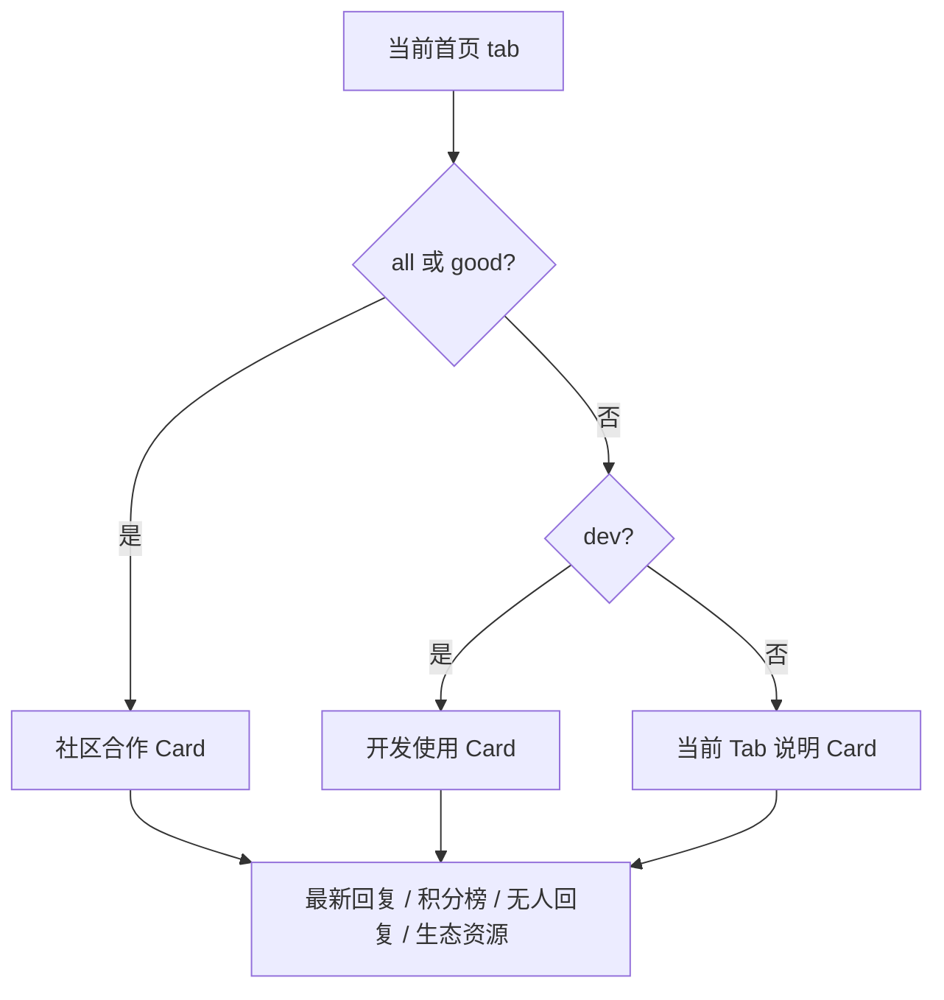

## Context

当前 `tabs` 表负责首页按钮的 label、visible、sort order 和 scope，但有效 topic key 仍分散在共享 Zod enum、Web 发布/编辑表单、标签映射、API 可见性集合和 seed 中。首页将 `all` 作为合成项，其余项按数据库排序；`good` 虽存于注册表，却由 API 转换为精选条件。`job` 是带 `job_meta` 的 topic，但 `all` 查询当前排除它。`dev/test` 被当作 admin scope，其中测试数据库快照显示 `test` topic 精确值和规范化值均为 0。

本变更保留 `share/ask` 及全部历史 topic，不解决现存空 tab 数据。新增社区主题仍沿用单一 `topics.tab`，避免本次同时引入标签或多维分类模型。

## Goals / Non-Goals

**Goals:**

- 增量加入 `tech/ai/ideas/career/life/event`，并让 API、DB、Web 与文档使用同一有效集合。
- 固定 `all` 最左、`dev` 位于公开项之后、`good` 最右，同时允许管理员调整中间公开项顺序。
- 首页和发帖页按当前 Tab 呈现明确、可访问且响应式的说明与发布规范。
- 保留 `job` 权限与 `job_meta`，同时将招聘作为常规首页 Tab 纳入 `all`。
- 在确认零引用后退役 `test`，不丢失 topic。

**Non-Goals:**

- 不迁移 `share/ask` 或空 tab topic，不引入 topic tags/type/board 多维模型。
- 不实现 `event_meta`、活动状态、活动专区或交易能力。
- 不改变招聘角色授予、`job_meta` 字段或招聘专区筛选能力。
- 不修改 Base UI/shadcn primitives。

## Decisions

### 使用共享有效 key 集合，展示元数据留在 Web

`packages/shared` SHALL 提供小写单词 key 的只读集合和创建/编辑 enum，API 与 Web 表单从该集合派生约束。Tab label 仍来自数据库，以保留后台改名能力；Web 维护按 key 索引的说明和发布提示，并以数据库 label 作为 Card 标题。测试 SHALL 断言 seed、共享 key、Web presentation map 和后台筛选不存在遗漏。

替代方案是让 API 完全信任 `tabs` 表。该方案会把运行时配置变成写入合约，并使 `good/dev` 等特殊语义无法只靠数据表达，因此不采用。

### 保留单一 tab 语义并采用增量集合

有效注册顺序为：

| 顺序         | key      | label | scope  |
| ------------ | -------- | ----- | ------ |
| 合成左端     | `all`    | 全部  | public |
| 10           | `share`  | 分享  | public |
| 20           | `ask`    | 问答  | public |
| 30           | `tech`   | 技术  | public |
| 40           | `ai`     | AI    | public |
| 50           | `ideas`  | 创意  | public |
| 60           | `career` | 职场  | public |
| 70           | `life`   | 生活  | public |
| 80           | `event`  | 活动  | public |
| 90           | `job`    | 招聘  | public |
| 固定倒数第二 | `dev`    | 开发  | admin  |
| 固定右端     | `good`   | 精华  | public |

`all` 不写入数据库。首页组合 SHALL 使用 `[all] + sortedVisiblePublicWithoutGood + [dev when allowed] + [good when visible]`，从而不依赖可编辑 sort order 保证端点位置。隐藏 `good` 时不渲染它，但其他项顺序不变。

替代方案是只给 `good/dev` 设置很大的 sort order。管理员仍可制造顺序冲突，不能满足“始终最右”的约束，因此不采用。

### 招聘是常规 Topic，结构化能力是附加层

`job` SHALL 进入 `all` feed，并与其他公开 topic 共享回复、收藏、置顶和精选能力。创建权限、普通 topic 与 job 的转换限制、`job_meta` 事务及招聘专区保持不变。`event` 本次只保存普通 topic 字段，时间、地点、组织方和报名方式由发布规范要求写入正文。

替代方案是继续从 `all` 排除招聘。该行为与“招聘是常规 Tab，只多结构化信息”的产品定义冲突，因此废弃。

### 首页首卡按 Tab 互斥选择

`all/good` 继续显示现有社区合作 Card；其余有效 Tab 不显示社区合作。桌面端说明位于右侧首位；移动端必须在 topic feed 前提供来自同一元数据的紧凑说明，完整 sidebar 模块仍可按现有 feed archetype 重排。

替代方案是在所有页面叠加说明 Card。该方案增加侧边栏长度且与用户确认的互斥规则冲突，因此不采用。

### 发帖页保留硬性规范并追加动态内容

发帖页右侧固定为：发布规范 Card、当前 Tab 说明 Card、`job_meta` 信息（仅 `job`）。发布规范使用 MUST 语气概括禁止违法、攻击、垃圾、无关广告、敏感信息泄漏、冒充原创及未披露商业关系等规则，并链接唯一权威业务规则。`JobMetaForm` 不得替换前两项。

移动端 SHALL 在提交按钮之前展示发布规范和当前 Tab 的紧凑说明；切换 Select 后说明可感知地更新，并通过现有 Field label/description 关系保持键盘和辅助技术可用。招聘无权限状态继续由 Web 禁用和 API 403 双重约束。

替代方案是保留一张混合“发布建议”。软性写作建议无法表达硬性治理规则，也无法清晰解释当前 Tab，故拆分为两个职责稳定的 Card。

## Database Change Audit

- 变更类型：只改 `tabs` 行和 seed，不改 PostgreSQL schema、索引、约束或 `topics` 行。
- migration SHALL 幂等插入六个新公开 key，更新基线 label/scope/sort order，但不得覆盖现有 `visible` 运营值。
- 删除 `test` 前 SHALL 在 migration 的同一事务中检查精确 `tab='test'` 及 `lower(btrim(tab))='test'`；任一计数非零即抛错并回滚。
- migration SHALL 删除 `tabs.key='test'`；历史已执行 migration 不修改，新 migration 表达退役。
- seed SHALL 不再插入 `test`，且继续保留已有行的 visible 值。
- 本次不处理测试数据库快照中的空 tab topic，也不打印 topic 内容或用户数据。

## Risks / Trade-offs

- [新增 Tab 内容稀疏] → 保留后台 visible 开关，运营可隐藏低活跃项而不改变 API 合法性。
- [招聘进入 all 增加商业信息密度] → 继续 recruiter 权限、结构化字段和治理规则，并监控列表占比。
- [多处 key 映射漂移] → 共享合法集合并增加 registry/presentation/admin filter parity tests。
- [旧客户端不认识新增返回值] → 旧 key 不变；新增值只出现在对应新 topic，OpenAPI 明确扩展 enum。
- [删除 test 时快照与生产发生偏差] → 发布 migration 现场再次断言零引用，失败时停止部署而非自动重分类。
- [移动端说明出现在列表或按钮之后] → 对首页和 compose 分别增加顺序验收测试及 375px 人工检查。
- [Tab 含义存在交叉] → Card 提供短边界说明；本次接受单一主分类，不引入多标签模型。

## Migration Plan

1. 在测试服务器通过受控数据库连接只读统计 `topics.tab`，确认规范化 `test` 为 0，并记录聚合结果但不输出连接信息、凭据、用户内容或其他环境秘密；如需 SSH，仍须先打印并确认 `.cnode-ops.md` 中的 alias。
2. 先发布兼容新增 key 的共享/API/Web 代码及 reviewed migration；migration 插入新 tabs、调整顺序并安全删除 `test`。
3. 生成 OpenAPI，验证创建、编辑、首页查询、sidebar、招聘权限和 admin filters。
4. 测试环境应用 migration 后检查普通用户与管理员 Tab 顺序、`job` 在 `all` 中可见、移动端说明位置及各 Card 互斥关系。

回滚应用版本时，新 tab topic 可能已存在，旧 API 无法编辑其 enum。因此数据库 migration 不做自动 down migration；回滚前须先停止新增 key 写入，并使用经审核的数据处置方案或恢复兼容代码。`test` 注册行可在确认需要时重新插入，但不得绕过 topic 零引用检查假设。

## Open Questions

- 活动达到何种数量和数据质量后启动独立 `event_meta` OpenSpec change。
- 是否为新增社区 Tab 设置发帖账号年龄或积分门槛；本次沿用普通发帖治理。
