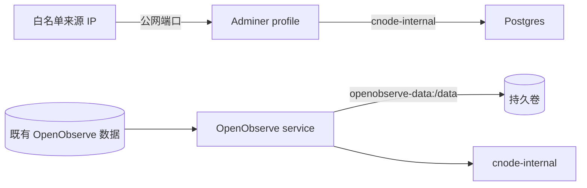

## Context

`docs/deployment/docker-compose.yml` 同时承担生产服务基线和低频一次性任务入口。`migrate-schema` 可以直接复用 API 服务定义，`migrate-data`、`reconcile` 和 legacy external network 则已随 MongoDB 下线，长期保留这些命名服务只会增加配置与网络边界。

Adminer 需要连接 `cnode-internal` 中的 PostgreSQL，但用户选择按需直接发布宿主公网端口。Compose 端口发布不能过滤来源 IP，因此访问控制属于宿主机防火墙、云安全组或反向代理的外部运维边界。OpenObserve 已在生产服务器运行，本次只把其服务定义、持久卷和 root 凭据变量纳入版本化 Compose，不在实施或验证中启动生产实例。

利益相关者包括执行迁移和生产部署的运维人员，以及负责主机或云网络访问控制的管理员。

## Goals / Non-Goals

**Goals:**

- 删除全部低频 migration 服务与 legacy network，schema migration 通过隔离的一次性 API 容器执行。
- 提供默认不启动、由显式 profile 开启的 Adminer 数据库查看入口。
- 准确表达公网 Adminer 的外部白名单责任和关闭流程。
- 将已运行的 OpenObserve 以长期服务、持久卷和外部 dotenv secret 纳入 Compose 基线。

**Non-Goals:**

- 不改变 MongoDB 到 PostgreSQL 的映射、清表或对账算法。
- 不在在线 `api` 容器内执行迁移命令。
- 不由仓库自动创建防火墙、云安全组、TLS 或 Adminer 单点登录。
- 不将数据库凭据写入 Compose、文档或 Adminer 环境变量。
- 不配置 OpenTelemetry SDK/Collector、traces/logs/metrics 接入、OpenObserve UI 端口、反向代理、TLS、root 凭据轮换或生产实例启动。
- 不改变 PostgreSQL schema、Drizzle migration、seed 或运行时字段语义。

## Decisions

### 1. 删除已下线 MongoDB 的 Compose 入口

删除 `migrate-data`、`reconcile`、legacy external network 和生产 dotenv 中的 Mongo migration 配置。历史脚本保留为源码记录，但不再出现在生产 runbook。

### 2. Schema migration 复用 API 服务定义

Reviewed schema migration 继续作为发布中的显式步骤，但通过 `docker compose run --rm api pnpm db:migrate` 创建隔离的一次性容器。该命令复用不可变 API 镜像、根 `.env`、内部网络和 PostgreSQL dependency，不在在线 API 容器中执行，也不要求长期保留低频服务定义。

拒绝保留 `migrate-schema`：稳定运行阶段更重视 Compose 长期服务清单的简洁性，单独命名服务没有提供额外隔离或镜像能力。

### 3. Adminer 使用显式 profile 并直接发布公网端口

Adminer 使用固定版本的官方镜像，不使用 `latest`；仅加入 `cnode-internal`，默认数据库服务器指向 `postgres`，等待 PostgreSQL healthy，并通过专用 profile 按需启动。启动时 Compose 将可配置宿主端口发布到所有宿主接口，以满足用户选择的直接公网访问方式。

Adminer 使用镜像内置的 `curl` 探测本机 HTTP 入口。该检查只确认 Adminer Web 服务可响应，不携带或验证 PostgreSQL 凭据。

Adminer profile 不随普通 `docker compose up` 启动。部署文档必须把外部来源 IP 白名单检查置于启动命令之前，并要求使用结束后停止和删除 Adminer 容器。数据库认证继续使用 PostgreSQL 账号，不向 Compose 添加明文默认凭据。

拒绝默认仅绑定 `127.0.0.1` 或只加入内部网络：这两种方案风险更低，但不符合本次选定的直接公网端口操作方式。

拒绝在 Compose 内表达来源 IP 白名单：Docker Compose `ports` 没有来源 CIDR 过滤能力，伪造这样的配置会产生错误安全保证。

### 4. OpenObserve 采用用户指定的长期服务定义

Compose 增加 `openobserve` 服务，使用用户指定的 `public.ecr.aws/zinclabs/openobserve:latest`、`env_file: ${CNODE_ENV_FILE:-.env}`、`openobserve-data:/data`、`cnode-internal` 和 `restart: unless-stopped`，并声明顶层 `openobserve-data` volume。dotenv example 在 Observability 分组中加入空的 `ZO_ROOT_USER_EMAIL` 和 `ZO_ROOT_USER_PASSWORD`；真实值只允许存在于忽略或外部 dotenv 文件。

用户明确选择 `latest`，因此不采用固定 tag 或 digest。该选择允许后续 pull 获得上游最新镜像，但牺牲版本可复现性和可预测回滚；部署前必须记录实际 image ID/digest，升级前必须确认数据兼容性和可恢复备份。

本次不增加宿主 `ports`、profile 或 telemetry 发送配置。OpenObserve 是长期服务，并在 `cnode-internal` 提供 `http://openobserve:5080` 作为 Compose 内部入口；UI 公网访问路径及现有日志接入沿用生产环境现状，不在仓库中推测或记录私有拓扑。后续 `add-opentelemetry-observability` 可以依赖该内部入口增加 Collector，但 Collector 和应用 instrumentation 不属于本 change。

OpenObserve 官方发布镜像是 distroless，不假定存在 shell、`curl` 或 `wget`。健康检查直接执行镜像内置的 `/openobserve node status`，由 CLI 访问本机节点状态接口；较长的启动宽限期覆盖数据和服务初始化。

拒绝在实施验证中运行 `docker compose up openobserve`：生产已有实例，未经核对 Compose project、container 和 volume 身份就启动可能产生第二实例或空数据卷。

### 5. 根 `.env` 是唯一部署输入

Compose 默认从仓库根 `.env` 向服务注入配置，runbook 不要求临时 export 环境变量。命令均从仓库根直接执行，首次设置后可按章节重复运行。

### 6. 文档按职责收敛

`docs/deployment/deployment.md` 负责可执行命令、启动前置条件、Adminer 关闭步骤和 OpenObserve 既有实例纳管前核对；`docs/deployment/docker-compose.yml` 只表达通用编排；dotenv example 只提供非敏感配置和空 secret 项；`docs/biz/migration-background.md` 只保留“一次性隔离容器和受控报告路径”的长期边界。

被替换内容分类：删除重复服务定义；合并 migration 操作到部署说明；压缩 migration background；保留 schema migration、备份、回滚和 secret 安全约束。

## Risks / Trade-offs

- [Adminer 公网端口在白名单缺失或错误时暴露数据库登录面] → profile 默认关闭；文档规定白名单为启动前置条件、要求验证来源限制并在使用后停止容器。
- [Compose 无法验证外部白名单已经生效] → 明确这是人工部署 preflight，不把 profile 或端口变量描述为安全控制。
- [固定 Adminer 版本需要维护升级] → 版本更新作为依赖维护处理，避免不可审计的 `latest` 漂移。
- [OpenObserve `latest` 在 pull 后发生不可预测升级] → 按用户决定保留 `latest`，部署前记录解析后的 image ID/digest、检查 release compatibility，并保留可恢复数据备份与旧 image ID。
- [现有 OpenObserve 与新增 Compose project 或 volume 名称不一致] → 首次纳管前只读核对现有 container、实际 image、mount 和 Compose labels；确认数据卷映射后才允许由运维执行变更，本次实现不启动容器。
- [空的 root 凭据变量被误认为有效生产配置] → dotenv example 明确是占位模板，部署 preflight 要求外部 dotenv 提供非空真实值且不得输出；已初始化实例不把变量变更描述为凭据轮换。

## Migration Plan

1. 更新规范，移除对独立 migration 服务和 legacy network 的要求并增加 Adminer 安全边界。
2. 删除三个 migration Compose 服务，加入 profile 管理的 Adminer、OpenObserve 服务、持久卷和安全配置占位项。
3. 将部署说明改为只依赖根 `.env` 的顺序化 runbook，覆盖 schema migration、Adminer 和 OpenObserve 纳管。
4. 更新 migration background 的长期执行边界。
5. 在部署 preflight 中仅渲染并验证默认配置、migration 命令、Adminer profile 和 OpenObserve 定义；不得由普通仓库验证启动 Compose，也不得启动或重建生产 OpenObserve。

回滚时恢复原 Compose 服务和对应规范、文档，停止并删除 Adminer 容器，并让既有 OpenObserve 继续使用变更前的启动方式与原数据卷。该变更不执行数据库或 OpenObserve 数据操作，也不需要数据回滚。

## Database Change Audit

本变更不修改 PostgreSQL schema、Drizzle migration、seed/bootstrap、索引、约束、backfill、数据修复、数据清理、保留策略或字段语义。Adminer 只是数据库客户端入口；OpenObserve volume 只声明既有持久化边界；实施验证不得通过 Adminer、migration 命令或 OpenObserve 修改真实数据。

## Open Questions

- 实施时需要从 Adminer 官方发布中选择并记录固定镜像版本；不得使用 `latest`。
- 目标环境采用宿主机防火墙、云安全组还是反向代理执行来源 IP 白名单，由环境运维方在仓库外决定。
- 首次由 Compose 纳管 OpenObserve 前，环境运维方需要确认既有实例实际使用的 Compose project、container 和 volume 身份。
