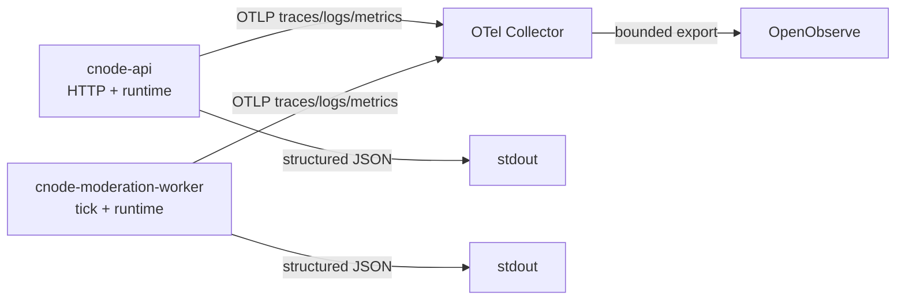

## Context

`apps/api/src/bootstrap.ts` 已在业务模块加载前为 API 与 moderation worker 初始化共同的 NodeSDK，`apps/api/src/telemetry/index.ts` 当前只配置 OTLP trace exporter、采样、instrumentation 和有界 shutdown。API 使用 Hono `logger()` 输出文本 access log，其他运行事件使用零散 `console.*`；Collector 只配置 traces pipeline。现有 trace 默认按 10% head sampling，因此不能用已导出 spans 准确推导全量请求指标。

两个运行角色使用同一镜像和 bootstrap，但分别以 `cnode-api` 与 `cnode-moderation-worker` 作为 `service.name`。设计必须保持这一身份边界，并确保 Collector 或 OpenObserve 故障不影响请求和 worker 循环。

## Goals / Non-Goals

**Goals:**

- 为每个 API 请求生成一条可检索且字段固定的 completion access log。
- 为 API 与 worker 提供源头 allowlist 的结构化运行日志并关联可用 trace context。
- 以独立 metrics SDK 全量记录 API HTTP、worker tick 和 Node.js runtime 指标。
- 让 traces、logs 和 metrics 共享 resource identity，但可独立启停、降级和有界关闭。
- 将三种信号经内部 Collector 发送到 OpenObserve，并在应用和 Collector 两层控制敏感数据。

**Non-Goals:**

- 不观测 Web、PostgreSQL、Redis、Docker、宿主机、Collector 或 OpenObserve 自身。
- 不建设 dashboard、alert 或 tail sampling。
- 不记录用户行为、用户身份、业务内容、邮件内容、SQL 或原始异常详情。
- 不改变 moderation scan 的业务状态机，也不为生成指标增加数据存储查询。

## Decisions

### 1. 使用应用日志接口同时写 stdout 和 OTel Logs

建立一个字段受控的结构化日志接口：始终写单行 JSON stdout；logs signal 启用时，同时创建 OTel LogRecord。日志接口从 active context 获取 trace ID、span ID 和 sampled flag，而调用方只提供稳定 event name、severity 与事件 allowlist 字段。

拒绝由 Collector 读取 Docker stdout：这需要 Docker 日志目录或 socket 权限，会把实现绑定到宿主机日志驱动，且难以稳定附加 OTel resource 和 active trace context。拒绝只发送 OTLP logs：Collector 故障或 telemetry 禁用时会失去 `docker compose logs` 运维兜底。

同一应用日志不会再由 Collector 的 filelog receiver 重复采集，避免 stdout 与 OTLP 双份入库。

### 2. 每个 HTTP 请求只记录一条 completion access log

在现有 Hono telemetry middleware 的 finally 路径完成 duration、最终 status 和匹配 route template 的记录，并替换 Hono 文本 `logger()`。Access log 固定为 INFO，4xx/5xx 通过结构化 status 查询；未处理异常另写一条 ERROR 事件。

拒绝 start/end 两条日志，因为它使全量日志量翻倍且正常 completion 已能表达延迟。拒绝按 status 自动提升 access log severity，因为 5xx 同时已有 error event，会造成重复 ERROR 告警；4xx 也不等于服务异常。

`/health` 首期不排除。若部署后健康检查占据主要日志量，应通过后续有证据的 retention/filter change 处理，而不是让“每个请求”存在隐式例外。

### 3. Metrics 独立于 trace sampling

为 NodeSDK 配置 OTLP metric exporter 和 periodic metric reader。HTTP metrics 在 Hono middleware 中直接记录；worker metrics在 tick 边界直接记录；Node runtime 使用与当前 OTel 版本兼容的 runtime instrumentation。HTTP request count/duration 覆盖所有请求，不使用 spanmetrics connector。

拒绝从 traces 派生指标，因为默认 10% head sampling 会使请求数、错误率和延迟分布失真。拒绝在首期增加 PostgreSQL/Redis 或业务实体指标，因为它们超出运行角色边界并引入额外基数与数据访问风险。

### 4. 使用固定 metric instruments 与有限 attributes

API instruments 覆盖 request count、duration、active requests 和 errors；允许 method、route template、status/status class 与 allowlist error type。Worker instruments 覆盖 tick count、duration、lock outcome 和 failures；只有现有 drain 调用能自然返回可靠结果时才增加 processed jobs count。

所有 Request ID、trace ID、实际 URL、用户/内容/job ID 均禁止成为 metric attributes。两个角色只通过 resource `service.name` 区分，不重复添加 role data point attribute。

### 5. 三信号共享 resource，但独立配置与降级

Telemetry 初始化先解析共同 resource 和总开关，再分别初始化 trace、log 和 metric provider/exporter。每个信号具有独立启停状态；一个信号解析或初始化失败时记录不含配置值的诊断，并只将该信号置为 no-op。

配置使用内部 OTLP base endpoint 派生 `/v1/traces`、`/v1/logs` 和 `/v1/metrics`，避免继续把 trace-specific URL 误当作通用 endpoint。保留总开关，并提供三个信号开关；Compose 可在单个 service 上覆盖通用开关，而不增加 API/worker 专用变量矩阵。

拒绝单一 all-or-nothing `enabled` 状态，因为日志量或 metrics 配置问题不应迫使 traces 一并关闭。拒绝三个完全独立的必填 endpoint，因为生产拓扑只有一个内部 Collector，额外配置不会提供实际价值。

### 6. 采用源头 allowlist 与 Collector 二次清理

日志接口不接受任意对象展开，只允许标量和已定义事件字段；Error 只映射 allowlist `error.type`。Collector logs transform 再删除认证、session、body、邮件、用户内容、URL query、SQL、连接信息和 exception detail 等已知属性。Metrics 通过测试固定 instrument attributes，而不是依赖 Collector 修复高基数。

拒绝记录完整 Error 后再依赖正则脱敏，因为 message/stack 可能包含无法枚举的用户内容、地址或 secret。Request ID 可以存在于 logs 和 spans，但继续禁止进入 resource 与 metrics。

### 7. 统一有界 shutdown，不串行放大等待

Telemetry runtime 保存每个已启用 provider 的 shutdown 操作，并在共同的总超时内并发执行。单个 reject 或 timeout 只产生安全诊断，进程随后退出。应用请求路径不等待 export，使用 batch processors/readers 和有界队列。

拒绝依次为三个信号各等待完整超时，否则当前 3 秒 shutdown 上限可能被放大为三倍。

## Risks / Trade-offs

- [全量 access log 增加 OpenObserve 存储量] → 每请求仅一条 completion log、固定字段、无 body/query/stack，并在部署验证中检查 ingestion 量。
- [90% 未采样请求的 trace ID 无对应 trace] → 日志记录 sampled flag，以 Request ID 作为全量日志检索键，不承诺所有日志可跳转 trace。
- [stdout 与 OTLP 双写增加序列化成本] → 只序列化小型固定对象，不在请求路径等待 exporter；测试请求行为与延迟边界。
- [OTel JS logs 使用 0.x 版本线] → 所有 OTel 包保持当前兼容版本组，封装在 telemetry 模块内，不向业务契约暴露 SDK 类型。
- [错误日志过度脱敏降低排障细节] → 保留稳定 event、error type、route、status、Request ID 和已采样 trace；不以泄露用户数据换取任意错误详情。
- [metric attributes 意外高基数] → 对每个 instrument 编写允许属性测试，禁止调用方传入任意 attribute map。
- [三信号 exporter 同时故障消耗内存] → 应用与 Collector 均使用 batch、有限 queue、timeout 和 fail-open；达到限制时丢弃 telemetry。
- [worker processed count 需要改变 drain 返回值] → 仅在现有执行路径可自然返回结果时实施，否则省略该指标且不增加数据库/Redis 查询。

## Migration Plan

1. 增加兼容版本的 logs/metrics/runtime 依赖、独立配置解析和测试 exporter 注入点，不改变默认业务入口。
2. 引入结构化日志接口，迁移 API access/error/lifecycle 与 worker tick/lifecycle 日志，验证 stdout 在 OTLP 禁用时仍可用。
3. 增加 API、worker 和 runtime metrics，并以 in-memory exporter 测试计数、route template、finally 清理和 attribute allowlist。
4. 扩展 Collector 三条 pipeline、Compose safe example 和部署文档，执行静态配置检查、secret scan 与只读 Compose render。
5. 先部署 Collector/OpenObserve ingestion 配置，再部署应用并分别启用 logs 和 metrics；验证两个 `service.name` 的三种信号。
6. 若日志量、指标基数或 exporter 稳定性异常，通过信号开关关闭 logs 或 metrics 并重启 API/worker；stdout、业务和其他信号继续运行，无数据库回滚。

## Open Questions

- OpenObserve 当前部署版本对 OTLP logs/metrics 的 stream 命名和三信号查询关联行为需要在部署 preflight 中验证，但不得将环境特定结果写入长期文档。
- Worker drain 是否已经能无额外查询地返回 processed jobs 数量，应在实现前确认；若不能，首期按规范省略该 instrument。

## Database Change Audit

本 change 不修改 PostgreSQL schema、Drizzle migration、seed/bootstrap、索引、约束、字段语义、数据保留或业务数据。日志和指标验证不得写入、迁移、修复或清理真实 PostgreSQL 数据。
