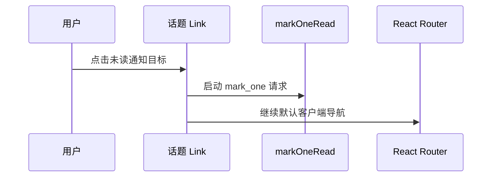

## Context

`Messages` 已通过 `useAsyncAction` 封装 `POST /api/v1/message/mark_one/:msg_id`，并在成功后同步“新消息”“过往消息”和 Header 未读数。“标记已读”按钮使用该 action，但 `MessageItem` 的关联话题 `Link` 未调用它，因此导航不会改变消息状态。

本变更仅调整 `/my/messages` 这一 directory/data-list 页面中的链接交互。现有 `Item`、`Link`、`Button`、语义色、布局和可访问名称保持不变。

## Goals / Non-Goals

**Goals:**

- 未读消息的关联话题链接在导航事件中同步启动现有单条已读 action。
- 保持 React Router 导航不被网络请求阻塞。
- 明确作者链接与已读消息链接不触发 mutation，并通过测试锁定行为。

**Non-Goals:**

- 不修改消息 API、数据库、消息创建规则或全量已读行为。
- 不增加乐观更新、失败重试或新的全局状态抽象。
- 不改变页面视觉、响应式结构、键盘操作和链接可访问语义。

## Decisions

### 在话题 Link 的 click 处理器中启动现有 action

`MessageItem` 仅在 `msg.has_read` 为 false 时，从关联话题 `Link` 的 `onClick` 调用已有 `onMarkRead(msg.id)`。`useAsyncAction.run` 会在事件处理期间立即调用异步函数，从而在组件因导航卸载前启动 `apiFetch`；处理器不 `preventDefault`，也不等待 Promise。

替代方案：先等待 API 成功再调用 `navigate`。拒绝原因是网络失败或延迟会阻塞用户访问通知目标。另一替代方案是把整个消息项设为可点击，拒绝原因是会与作者链接和“标记已读”按钮形成嵌套交互并扩大误触范围。

### 仅通知目标表达“已阅读”

作者头像和用户名链接不附加已读处理；已读消息的话题链接也不重复调用 API。这样只有打开通知所指向的话题/回复才改变状态。

替代方案：任何消息内链接都标记已读。拒绝原因是查看作者资料并不表示用户已查看通知内容。

### 使用路由组件测试验证事件边界

测试点击真实 `Link`，同时断言目标路由可达和 `apiFetch` 调用。另行覆盖作者链接与已读消息链接未调用 API，避免只测试内部回调而漏掉导航集成。

## Risks / Trade-offs

- [请求已启动但页面卸载后回调不再影响当前消息页] → 后端持久化仍会完成；用户返回消息页时 loader 和 Header 查询读取真实状态。
- [快速点击多条消息受 `useAsyncAction` 单 pending 防重入限制] → 保持现有单条已读操作语义，本次不扩展并发模型。
- [标记请求失败但导航继续] → 优先保证通知目标可访问；沿用现有异步 action 的错误反馈，不引入阻塞或回滚。

## Migration Plan

无需数据迁移或配置变更。发布 Web 代码即可；回滚时撤销话题 `Link` 的 click 处理器和对应测试，不影响已存储消息状态。

## Open Questions

无。
