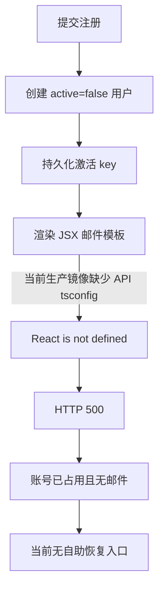
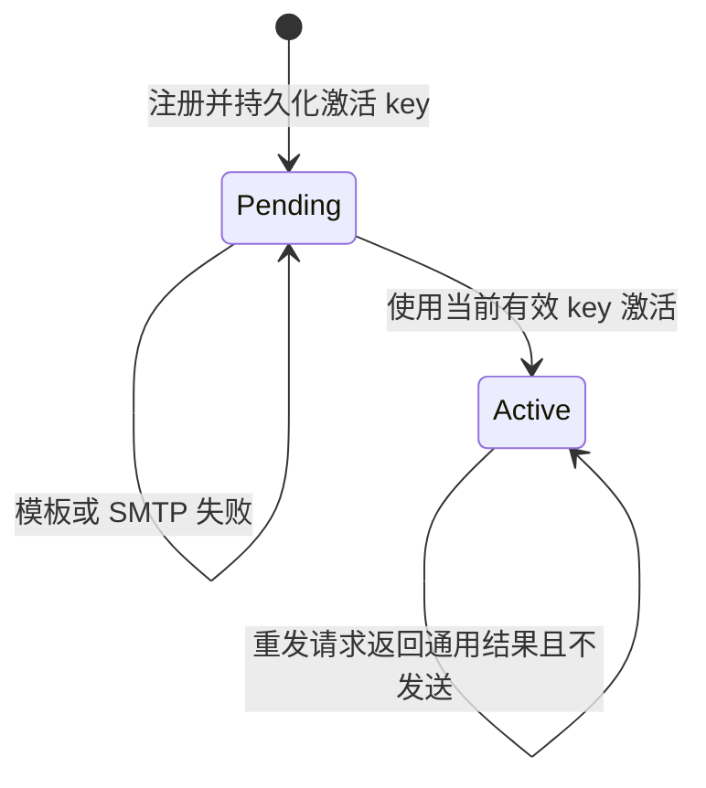

## Context

当前 API 容器通过 `tsx` 直接运行源码，但最终镜像只复制根 `tsconfig.base.json`，没有复制声明 `jsx: react-jsx` 的 `apps/api/tsconfig.json`。`apps/api/src/lib/mail-template.tsx` 因此可能被转换为依赖全局 `React` 的经典 JSX 调用，账号激活和密码重置在 SMTP 调用前抛出 `React is not defined`。

本地注册依次独立执行用户插入、retrieve key 更新和同步邮件发送。邮件失败时前两次 PostgreSQL 写入已经提交，最终请求却由全局异常处理器返回普通 500。现有 Web 和 API 没有激活邮件重发入口；同时 GitHub 关联和认证中间件未检查 `active`，使未激活用户可以绕过本地登录限制。

## Goals / Non-Goals

**Goals:**

- 修复最终 API 镜像中的 JSX runtime 配置缺失，并以最终镜像 smoke 覆盖该边界。
- 为已经持久化的未激活账号提供安全、限流、可重复执行的激活邮件重发路径。
- 让注册部分成功成为明确业务状态，而不是未分类 500。
- 统一本地密码、GitHub、cookie Session 和 API access token 的激活约束。
- 保持日志可定位失败阶段，同时不记录用户或激活凭据。

**Non-Goals:**

- 不引入队列、outbox 或新的邮件服务商。
- 不把 SMTP 接受请求等同于最终送达收件箱。
- 不修改邮件品牌模板、最多五次 SMTP 尝试或用户社区通知偏好。
- 不自动修改历史未激活用户数据。

## Decisions

### 1. 保留源码启动方式并复制 API tsconfig

本次采用最小修复：最终镜像复制 `apps/api/tsconfig.json`，继续由 `tsx` 启动源码，并在最终镜像内执行无网络的四类模板 smoke。根配置已经存在于镜像，补齐最近的 API 配置后，`tsx` 可稳定使用 `react-jsx`。

替代方案：改为构建阶段执行 `tsc`、运行 `dist`。该方案长期更强，但当前 API 通过 tsconfig paths 编译 workspace 源码，切换产物布局和 ESM 模块解析会扩大本次故障修复范围。替代方案：在模板文件显式导入 `React`。这会掩盖镜像漏复制编译配置的问题，且无法保证其他 TSX 文件的生产语义，因此不采用。

### 2. 将注册邮件失败建模为“账号已创建但邮件未发送”

创建用户和 key 后，模板或 SMTP 失败不删除用户，也不回滚已提交状态。API 使用 `503` 和稳定错误码 `account_created_email_failed` 表示邮件通道暂不可用，Web 明确告知账号已创建并提供重发入口。

替代方案：邮件失败时删除用户。SMTP 超时无法证明邮件未被接受，删除后可能出现可用激活链接对应账号已不存在，也会引入危险补偿删除。替代方案：先发送后创建用户。邮件中的 key 在发送时没有持久化归属，仍存在邮件已发送但账号创建失败的不一致。

### 3. 使用现有用户字段实现激活重发

新增 `POST /api/v1/auth/local/resend_activation`。请求包含用户名或邮箱、密码和 Turnstile token；服务端验证 `active=false` 与 bcrypt 密码后生成新 UUID，一次更新 `retrieve_key` 和 `retrieve_time`，再发送邮件。每次有效重发都轮换 key，使旧链接失效。邮件失败时保留新 key，下一次重发可以再次轮换。

接口对账号不存在、密码错误和已激活账号返回相同通用结果，不发送邮件；有效凭据下的邮件基础设施失败可以返回 `503`。请求同时应用按 IP 和按账号的限流，日志只保留请求关联、失败阶段、安全错误类型和尝试次数。

替代方案：只提交邮箱即可重发。该方式容易被用于账号枚举和邮件轰炸，需要更复杂的统一响应、冷却和滥用检测；当前用户持有本地密码，要求密码可显著缩小攻击面。替代方案：复用密码重置接口。激活和重置共享字段但状态转换不同，复用会继续混淆用户意图。

### 4. 在认证身份建立边界统一检查 active

本地登录在密码正确后返回 `account_inactive`。GitHub 关联老账号在写入绑定前检查 `active`，未激活时撤销或丢弃本次 OAuth token，不建立绑定或 Session。GitHub callback 命中已绑定但未激活账号时不刷新凭据、不设置 cookie，而是跳转到恢复入口。

认证中间件和 access token 查询边界同样只接受 `active=true`，从而使历史未激活 Session 和 token 不能继续访问受保护接口。GitHub 创建的新账号仍为 `active=true`，因为该路径保持现有第三方注册语义。

替代方案：成功关联 GitHub 后自动激活老账号。当前 callback 只选择 primary email，未强制检查 GitHub email 的 verified 状态，且关联凭据证明的是本地密码而不是邮箱控制权，因此不把关联视为邮箱激活。

### 5. Web 恢复界面沿用 account archetype

重发页面沿用 `AccountPage`、`AuthShell`、共享 `Form`、`Input`、`Button`、`Alert` 和 `TurnstileWidget`，不新增 primitive 或主题 token。注册部分成功和登录 `account_inactive` 状态链接到该页面；页面允许输入用户名或邮箱与密码。

表单保持单列布局，在 375px 至 1440px 使用同一行为树；输入具有关联 label、浏览器 autocomplete、可见校验消息，提交时使用 `aria-busy`、disabled button 和 `role=status`，失败后焦点与输入内容保持可恢复。

## Risks / Trade-offs

- [邮件发送已被 SMTP 接受但客户端超时] → 保留账号并允许轮换 key；重复邮件中只有最新 key 有效。
- [重发接口被滥用] → 要求密码和 Turnstile，并按 IP、账号双维度限流；未知账号与错误密码使用相同响应。
- [历史未激活用户已通过 GitHub 或 Session 使用站点] → 部署后其认证失效，需要通过重发入口激活；发布说明应提示客服该恢复路径。
- [共享 retrieve key 被密码重置覆盖] → 保持当前单 key 语义；任一新激活或重置请求使旧链接失效，UI 和响应避免承诺多个链接同时有效。
- [复制 tsconfig 只能修复当前源码运行模型] → 最终镜像 smoke 作为持续门禁；未来切换编译产物时按容器规格更新验证。

## Database Change Audit

本变更不修改 PostgreSQL schema、Drizzle migration、索引、约束、seed 或保留策略。`users.active`、`retrieve_key` 和 `retrieve_time` 的字段语义保持不变；重发仅轮换现有字段。没有自动 backfill、数据修复或清理，历史未激活用户按请求恢复。

## Migration Plan

1. 先补齐 API 镜像编译配置和最终镜像模板 smoke，阻止继续产生 `React is not defined`。
2. 发布 API 的结构化错误、重发接口、限流和统一激活检查，并重新生成 OpenAPI 输出。
3. 发布 Web 恢复页面及注册、登录错误状态接入。
4. 在测试 SMTP 下验证注册、失败恢复、重发、key 轮换和激活；检查日志不含 PII 或 key。
5. 部署后观察模板失败、SMTP 失败、重发成功和限流事件。回滚时必须同时回滚 Web 与 API；数据库无需回滚。

## Open Questions

无。异步 outbox、SMTP 最终送达跟踪和历史账号批量修复如有需要，应分别提出后续 change。
