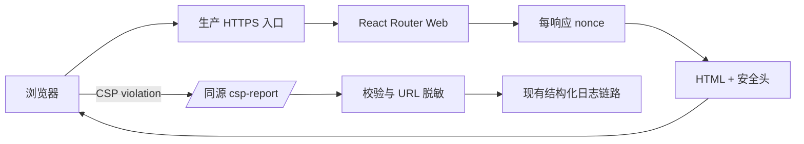
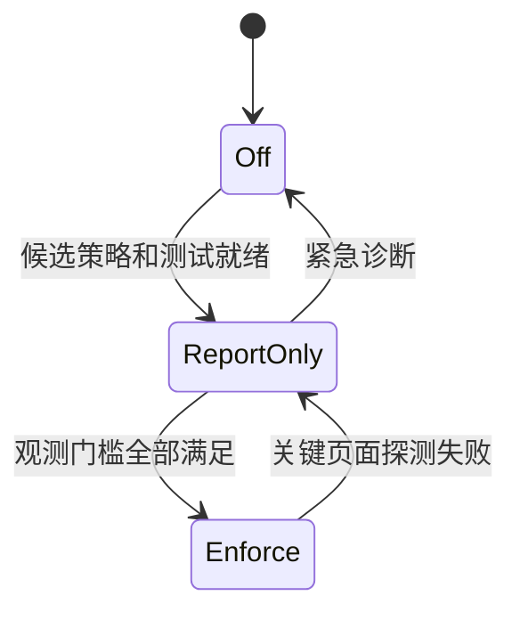

## Context

当前 `apps/web` 使用 React Router SSR，并由 `react-router-serve` 提供 Node 运行时。`apps/web/app/root.tsx` 在文档中直接输出主题初始化脚本与 `window.__CNODE_CONFIG__`，React Router 的 `<Scripts />` 和 `<ScrollRestoration />` 也可能生成需要 CSP 授权的脚本。生产探测显示 HTML 响应没有浏览器安全头，生产入口还存在仓库外的 Caddy 层。

该能力横跨 SSR 文档生成、响应头、匿名违规报告、部署配置和发布验证。CSP 一次性强制上线容易造成全站 hydration 失败，因此需要明确策略状态和回退边界。

## Goals / Non-Goals

**Goals:**

- 为 HTML 文档建立可测试的安全头基线。
- 以 Report-Only、观测门槛、强制模式三阶段落地 CSP。
- 使用每响应 nonce 授权必要内联脚本，不以 `'unsafe-inline'` 放宽最终 `script-src`。
- 让违规报告可观测，同时限制匿名输入、数据泄露和日志污染风险。
- 明确应用与反向代理的响应头所有权及运行时回退方式。

**Non-Goals:**

- 不改变 UI、路由业务行为、API CORS 或认证机制。
- 不在本 change 中代理第三方头像或缩减资源体积。
- 不启用 HSTS preload、`includeSubDomains`、COEP、COOP 或严格 CORP。
- 不配置 Cloudflare WAF、DNS 或源站网络访问控制。

## Decisions

### 1. CSP 由 Web 应用生成，部署入口不得覆盖

nonce 必须同时进入响应头与 SSR HTML，因此 CSP 的权威所有者是 `apps/web` 文档响应生成层。仓库外 Caddy 可以保留 TLS 和 HTTP 跳转职责，但不得生成另一份 CSP；HSTS 的最终发出层由实施时核实生产拓扑后选择一个唯一所有者。

备选方案是在 Caddy 写静态 CSP。该方案无法安全授权每次 SSR 生成的内联脚本，只能依赖固定 hash 或 `'unsafe-inline'`，且生产配置不在仓库内，难以通过应用测试验证，因此拒绝。

### 2. 使用自定义 `entry.server.tsx` 建立每响应 nonce

自定义服务端入口为每个文档请求生成密码学随机 nonce，将其注入 React Router SSR 渲染上下文或根路由可读取的数据，并在最终 Response 上设置同 nonce 的 CSP。`root.tsx` 将 nonce 传给自有内联脚本、`<Scripts />` 与 `<ScrollRestoration />`。实施前用最小测试确认当前 React Router 版本的 nonce 透传 API；若框架上下文不能无损传递，选择自定义 request context，而不是把 nonce存入进程全局、Cookie 或持久化存储。

备选方案是固定 SHA-256 hash。主题脚本较稳定但公开配置脚本随环境和版本变化，React Router 生成脚本也可能随构建变化，固定 hash 会增加发布耦合，因此不作为统一机制。进程全局 nonce 会让所有响应共享授权值，违反 nonce 隔离要求，因此禁止。

### 3. CSP 使用运行时阶段开关

定义 `off`、`report-only`、`enforce` 三种运行时阶段，默认生产上线阶段为 `report-only`；本地开发可为 `off`，避免 Vite HMR 和开发脚本迫使生产策略放宽。阶段配置只改变头名称和报告行为，不维护两套不同的候选指令。

备选方案是直接启用强制策略。由于现有内联脚本、第三方头像和多路由组件来源尚未经过全量观测，该方案故障半径为整个 Web 站点，因此拒绝。

### 4. 候选策略按资源类型最小授权

初始候选策略以以下边界为起点，最终值由 Report-Only 数据收敛：

| 指令 | 初始边界 |
| --- | --- |
| `default-src` | `'self'` |
| `base-uri` | `'self'` |
| `object-src` | `'none'` |
| `frame-ancestors` | `'none'` |
| `form-action` | `'self'` |
| `script-src` | `'self'` 与每响应 nonce |
| `connect-src` | `'self'`、生产 API origin，以及已验证的开发连接来源 |
| `img-src` | `'self'`、`data:`、`blob:` 与 `https:`；现有用户 Markdown 允许任意 HTTPS 图片，因此暂时不能只列举头像 origin |
| `style-src` | `'self'`；只有观测证明框架确需内联样式时才记录限定例外 |
| `font-src`、`manifest-src` | `'self'` |

不采用 `*` 或最终 `script-src 'unsafe-inline'`。除维持现有用户 Markdown 图片行为所需的 `img-src https:` 外，新外部来源必须按资源类型加入并由测试覆盖；图片代理与来源收窄属于后续独立变更。

### 5. 同源 Web 资源路由接收 CSP 报告

报告入口属于 Web 安全内部能力，不加入公开 `/api/v1` 合同。入口只接受浏览器 CSP 报告内容类型，设置较小请求体上限，并将允许字段映射为内部结构。URL 只保留 scheme、host 和同源 pathname；查询参数、片段、Cookie、请求头、代码片段及原始正文均不写日志。入口使用现有基础设施可用的限流边界，无法识别或超限的输入直接返回 4xx。

备选方案是只观察浏览器控制台。它无法覆盖真实生产路由和用户环境，不能作为强制上线依据。新增第三方报告服务会引入供应商、隐私和凭据配置，本 change 没有此需求，因此拒绝。

### 6. 安全头按风险分阶段

`nosniff`、referrer、frame ancestor/X-Frame-Options 和保守 Permissions Policy 可随 Report-Only 首次发布。HSTS 从短 `max-age` 开始，仅在生产 HTTPS 拓扑确认后启用；`includeSubDomains` 与 preload 明确不在范围内。COOP/COEP/CORP 可能影响 OAuth、跨源头像和弹窗流程，留待独立评估。

## Risks / Trade-offs

- [nonce 未传给框架生成脚本导致 hydration 失败] → 对渲染 HTML 与响应头做一致性测试，并在 Report-Only 环境执行真实浏览器 smoke test。
- [第三方头像来源不断变化使 CSP 过宽] → 先按已观测 origin 精确列举；头像自托管或代理作为独立性能变更，不在本 change 顺带实现。
- [CSP 报告入口成为日志放大或敏感数据入口] → 请求体上限、内容类型校验、速率限制、字段白名单、URL 脱敏和无正文响应。
- [代理层重复或覆盖安全头] → 发布前检查最终响应只存在单一策略，并在部署文档记录每个头的所有者。
- [HSTS 锁定错误入口] → 初始短 `max-age`、仅生产 HTTPS、运行时配置可回退；不启用子域和 preload。
- [Report-Only 长期不切强制而失去防护价值] → 在发布任务中定义观测窗口、未解释违规为零和自动化通过三个退出条件。
- [style-src 可能需要内联例外] → 将脚本与样式风险分开评估；任何 `'unsafe-inline'` 样式例外必须由观测证据支持并记录原因。

## Migration Plan

| 阶段 | 行为 | 晋级条件 | 回退 |
| --- | --- | --- | --- |
| 0 基线 | 增加测试、报告入口和通用安全头，CSP 为 `off` | 测试和类型检查通过 | 移除运行时开关或关闭安全头发布 |
| 1 观测 | 发布 `Content-Security-Policy-Report-Only` 与短期 HSTS | 关键页面测试通过；约定观测窗口无未解释第一方违规；最终响应无重复策略 | CSP 切回 `off`，HSTS `max-age` 调低或关闭 |
| 2 强制 | 切换为 `Content-Security-Policy` | 发布后首页及交互页面 smoke test 通过 | CSP 立即切回 `report-only` |
| 3 稳定 | 延长 HSTS `max-age`，清理临时策略例外 | 至少一个稳定发布周期 | 恢复上一档 `max-age` |

发布验证同时检查 2xx 和 HTML 4xx 响应，不输出 Cookie、环境变量或报告原文。

## Documentation Ownership

- `docs/arch/` 仅在 nonce 传递形成长期跨模块约束时记录架构决策。
- `docs/deployment/deployment.md` 是 CSP 阶段、HSTS、响应头所有权、生产探测和回退步骤的唯一操作说明。
- 不复制完整 CSP 字符串到多份文档；策略实现与测试是值的权威来源。
- 现有文档没有同类内容需要迁移，新增内容采用 merge 到现有部署文档，而不是创建 README/index。

## Database Change Audit

无 PostgreSQL schema、Drizzle migration、seed、索引、约束、回填、数据修复、保留策略或字段语义变更。

## Open Questions

- 当前生产 Caddy 是否已在仓库外注入任何安全头，以及 HSTS 应由 Caddy 还是 Web 应用唯一生成？
- 现有日志采集是否覆盖 Web 容器的结构化 stdout，并能为 CSP 事件设置合理保留期和告警？
- 强制模式前采用多长观测窗口，以及哪些管理后台、登录和 Turnstile 页面必须加入浏览器 smoke test？
- 当前 React Router 版本中，nonce 通过 request context 传给 `<Scripts />` 和 `<ScrollRestoration />` 的最小稳定实现是什么？
