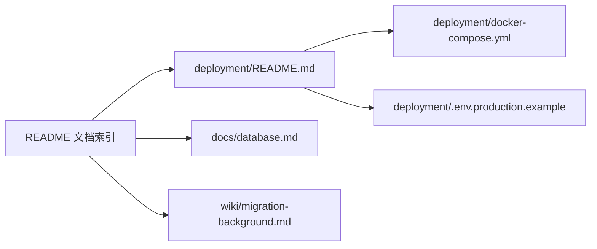

## Context

当前部署说明同时存在于 `deployment/`、`docs/`、`wiki/` 和 archived changes。可执行命令、数据库开发规则、一次性迁移步骤与历史背景存在重复，部分历史材料还混入只对单次执行有效的环境信息。本变更只调整版本库中的文档、规格和部署资产，不修改应用、数据库或 CI 行为。

## Goals / Non-Goals

**Goals:**

- 建立单一、简短、可执行的部署入口。
- 统一 Compose 文件名及其当前引用。
- 明确数据库开发文档与历史迁移背景的职责边界。
- 从当前规格和 archived changes 中移除环境特定信息，同时保留可复用的工程约束。
- 删除不再承担长期职责的重复文档。

**Non-Goals:**

- 不修改应用代码、数据库 schema、Drizzle migration、seed、索引、约束或数据。
- 不改变镜像构建、发布、服务编排和运行时配置行为。
- 不记录、同步或管理版本库之外的基础设施配置。
- 不重写 Git 历史，也不处理 `../nodeclub/` 或 `egg-cnode/`。

## Decisions

### 1. 部署 README 只保留稳定任务流

`deployment/README.md` 只描述准备镜像变量、拉取镜像、可选执行 reviewed migration、启动、验证和回滚。环境初始化、一次性数据修复和已完成迁移不进入该入口。

替代方案是保留完整运维手册并增加目录。该方案仍会让长期步骤与一次性记录共同演化，不能解决入口过长和职责重复，因此不采用。

### 2. Compose 使用稳定的通用文件名

版本化编排统一为 `deployment/docker-compose.yml`，所有当前文档和规格使用同一名称。该名称表达目录已提供的部署语义，避免额外的 `.prod` 后缀。

替代方案是保留旧文件名并增加兼容链接。仓库没有需要兼容的外部消费者证据，保留两个名称会延续重复引用，因此不采用。

### 3. 文档按任务生命周期分层

`docs/database.md` 负责开发期 schema 与 migration 规则，`wiki/migration-background.md` 负责已完成迁移的背景知识，archived changes 只保留设计意图和可复用决策。根 README 仅提供稳定导航。

替代方案是将所有数据库和迁移内容合并到一个文档。开发规则与历史背景的更新频率和读者不同，合并后会再次形成冗长入口，因此不采用。

### 4. 环境特定历史内容按语义清理

对 archived changes 逐项处理：能抽象为通用约束的内容改写为通用表述；只描述路径、连接方式、拓扑、凭据位置或单次运行结果的内容直接删除；已被当前规格取代且主要记录此类信息的 archive 整体删除。清理只作用于当前树，不改写历史提交。

替代方案是删除全部 archive 或保留原文并添加免责声明。前者会丢失仍有效的设计决策，后者仍暴露无长期价值的信息，因此均不采用。

## Risks / Trade-offs

- [删除历史文本时误删有效决策] → 以“是否可复用于任意部署环境”为保留标准，并通过 diff review 检查。
- [Compose 重命名后残留旧引用] → 全仓搜索旧文件名，并运行 Compose 配置验证。
- [精简 README 后缺少必要步骤] → 以镜像、migration、启动、验证和回滚五类长期任务作为最小验收集合。
- [规格仍保留过时措辞] → 同步修改主 specs，并执行 OpenSpec strict validation。

## Migration Plan

1. 完成 Compose 文件重命名和当前引用更新。
2. 精简部署入口，整合数据库与迁移文档，删除重复文件。
3. 清理主 specs 和 archived changes 中的环境特定文本。
4. 验证 Compose、OpenSpec、secret scan 和工作树差异。

文档变更不影响运行状态。若发现必要信息被删除，可从 Git 历史恢复通用内容并重新改写，但不得恢复环境特定文本。

## Open Questions

无。
