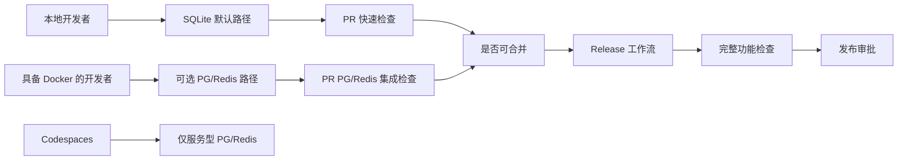

## Context

当前仓库已通过环境变量支持 sqlite 与 pg 切换，Redis 也支持真实服务与 mock 兜底。现有开发路径是 sqlite-first，且本地开发者并不一定都具备 Docker 环境；与此同时，发布质量又必须在 pg/redis 模式下得到验证。

`nodeclub/` 与 `egg-cnode/` 仍是历史行为参考，但本变更不触及业务逻辑本身，只将开发环境策略与 CI 门禁规则制度化：既保证无 Docker 也能开发，也保证发布前覆盖生产近似依赖。

## Goals / Non-Goals

**Goals:**
- 保持 sqlite-first 默认路径，确保无 Docker 也可本地开发。
- 支持研发在需要时自主切换到 pg/redis 进行生产近似调试。
- 将 Codespaces 范围限定为服务型基础设施（PostgreSQL/Redis），不要求应用容器化。
- 采用简化 CI：PR 必过检查 + release 必过完整功能检查。
- 在不引入 nightly 复杂度的前提下，保留发布时风险兜底。

**Non-Goals:**
- 不将 `apps/api` 或 `apps/web` 作为开发容器进行打包。
- 不把 Docker 设为所有本地开发者的强制前置条件。
- 不在每个 PR 执行完整功能检查。
- 不修改由 `nodeclub/` 继承并由 `egg-cnode/` 对照验证的业务行为。

## Decisions

### Decision 1: sqlite-first 作为默认开发契约
- Choice: sqlite 作为 onboarding 与日常开发的基线。
- Rationale: 启动成本最低，兼容无 Docker 环境。
- Rejected alternative: 本地强制 pg/redis。
  - Reason rejected: 会排除无容器环境的贡献者，并显著提高接入成本。

### Decision 2: pg/redis 在本地与 Codespaces 中均为可选切换
- Choice: 通过环境变量显式切换到 pg/redis 模式。
- Rationale: 保留灵活性，必要时可进行生产近似问题定位。
- Rejected alternative: 拆分为强隔离的多套开发 profile。
  - Reason rejected: 增加维护复杂度，并提升文档漂移风险。

### Decision 3: Codespaces 只提供服务型基础设施
- Choice: Codespaces 提供 PostgreSQL 与 Redis 服务，应用进程仍在 workspace 环境运行。
- Rationale: 复用现有命令体系，避免维护应用镜像链路。
- Rejected alternative: 在 devcontainer 中完整容器化应用。
  - Reason rejected: 对当前团队目标属于过度设计。

### Decision 4: CI 采用 PR 双必过 + release-only 完整功能门禁
- Choice: PR 必过 sqlite 快检与 pg/redis 集成检查；release 必过完整功能检查。
- Rationale: 在反馈速度与发布可信度之间取得平衡，并避免 nightly 运营负担。
- Rejected alternative: 增加 nightly 完整功能 lane。
  - Reason rejected: 与团队“简化流程、release 时兜底”的诉求不一致。

## Risks / Trade-offs

- [本地环境不一致] -> 以 sqlite 路径作为唯一默认基线，并明确 pg/redis 可选契约。
- [PR 时长受 pg/redis lane 影响] -> 将 PR 集成检查限定在关键路径，不引入完整功能范围。
- [发布前才暴露问题] -> 将 release 完整功能检查设为硬门禁，失败即阻断发布。
- [Codespaces 与本地路径漂移] -> 复用同一套环境变量契约与服务命名约定。
- [开发者本地跳过 pg/redis 验证] -> 用 PR 必过 pg/redis lane 兜底。

## Migration Plan

1. 定义并文档化 sqlite-first 默认契约与 pg/redis 可选契约。
2. 增加 Codespaces 的服务型基础设施定义（PostgreSQL/Redis）。
3. 增加 PR CI 门禁：sqlite 快检 + pg/redis 集成检查。
4. 增加 release CI 门禁：完整功能检查。
5. 配置分支保护与发布策略，强制 required checks。
6. 上线前执行一次端到端演练，再收紧策略。

## Open Questions

- release 完整功能检查只在语义化 tag 触发，还是同时覆盖手动 workflow_dispatch 发布？
- PR 的 pg/redis 集成检查最小关键路径应包含哪些能力（auth、话题读写、消息链路）？
- pg/redis 集成检查失败时，是否默认产出调试工件（日志/报告）？
