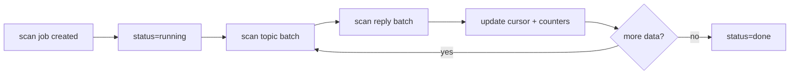
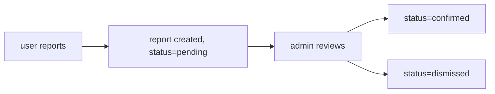

# Community Rules Notes

CNode 社区的内容审核规则、敏感词管理和用户举报处理。当前审核实现任务见 [docs/content-moderation.md](../docs/content-moderation.md)。

## Sources

- `apps/api/src/lib/moderation.ts` — 敏感词加载、匹配、预览、去重、命中计数。
- `apps/api/src/lib/moderation-scan.ts` — 扫描任务生命周期、批量扫描、hit 插入。
- `apps/api/src/lib/db.ts` — `keywordQueries`、`reportQueries`、`auditQueries`。
- `apps/api/src/routes/admin.ts` — 敏感词管理、举报处理、审核管理路由。
- `packages/db/src/schema/moderation_scan.ts` — `moderationScanJobs`、`moderationHits`。
- `packages/db/src/schema/sensitive_word.ts` — `sensitiveWords`。
- `openspec/specs/content-moderation/spec.md`、`openspec/specs/anti-spam/spec.md`、`openspec/specs/content-lifecycle/spec.md`。

## Scope

记录内容审核的业务规则、数据结构和处理流程。不包含审核 API 路由签名（见 `api/openapi.yaml`）。

## Sensitive Words

### Data Model

| Field      | Type               | Description              |
| ---------- | ------------------ | ------------------------ |
| `id`       | serial             | PK                       |
| `word`     | text, unique       | 敏感词，不区分大小写匹配 |
| `category` | text, nullable     | 分类标签                 |
| `hitCount` | integer, default 0 | 被命中次数               |
| `createAt` | timestamp          | 创建时间                 |

### Management

| Action   | Route                        | Effect                             |
| -------- | ---------------------------- | ---------------------------------- |
| List     | `GET /admin/keywords`        | 返回所有敏感词，按创建时间倒序     |
| Add      | `POST /admin/keywords`       | 添加单个敏感词，返回新记录         |
| Bulk add | `POST /admin/keywords/bulk`  | 批量添加，`on conflict do nothing` |
| Remove   | `DELETE /admin/keywords/:id` | 删除敏感词                         |

添加敏感词后调用 `invalidateWordCache()` 清除缓存，使新词立即生效。

### Matching

| Item     | Value                                            |
| -------- | ------------------------------------------------ |
| 算法     | case-insensitive substring                       |
| 缓存 TTL | 60 秒 (`CACHE_TTL = 60000`)                      |
| 缓存失效 | `invalidateWordCache()`                          |
| 返回     | `ContentHit[]` with `word`, `keywordId`, `index` |

`matchContent(content, words)` 对每个敏感词做 `content.toLowerCase().indexOf(word.toLowerCase())`，命中返回 `ContentHit`。

### Submission Check

`checkContent(content)` 流程：

1. `loadWords()` — 加载敏感词（从缓存或 DB）
2. `matchContent(content, words)` — 匹配
3. `incrementSensitiveWordHits(hits)` — 对每个命中的敏感词 `hitCount += 1`
4. 返回 `{ hit: boolean, words: string[] }`

命中时 API 返回 `422`：`回复内容包含敏感词: word1, word2`。

## Scan Jobs

### Data Model

| Field              | Type                 | Description                                                        |
| ------------------ | -------------------- | ------------------------------------------------------------------ |
| `scope`            | text                 | `topics` / `replies` / `all`                                       |
| `mode`             | text                 | `historical` / `incremental`                                       |
| `reason`           | text                 | `keyword_added` / `manual` / `scheduled`                           |
| `status`           | text                 | `pending` / `running` / `paused` / `done` / `failed` / `cancelled` |
| `cursorTopicId`    | integer              | topic 批次游标                                                     |
| `cursorReplyId`    | integer              | reply 批次游标                                                     |
| `batchSize`        | integer, default 200 | 每批扫描数量                                                       |
| `throttleMs`       | integer, default 500 | 批间间隔                                                           |
| `maxBatchesPerRun` | integer, default 100 | 单次运行最大批次                                                   |
| `scannedCount`     | integer              | 已扫描总数                                                         |
| `hitCount`         | integer              | 命中总数                                                           |

### Scan Flow

### Batch Scanning

| Step        | Logic                                                                                     |
| ----------- | ----------------------------------------------------------------------------------------- |
| Topic batch | `WHERE deleted=false AND status!=draft`，historical 按 `id DESC`，incremental 按 `id ASC` |
| Reply batch | `WHERE deleted=false`，同上游标策略                                                       |
| Field scan  | topic: `title` + `content`；reply: `content`                                              |
| Hit insert  | `onConflictDoNothing` by `dedupeKey`                                                      |

### Hit Deduplication

`dedupeKey` 格式：`{targetType}:{targetId}:{field}:{keywords joined by |, lowercase}`

`moderation_hits.dedupe_key` 有 unique index，重复扫描不会创建重复 hit。

### Hit Preview

`createHitPreview(content, index, radius=80)`：以命中位置为中心，取前后各 80 字符，超出部分用 `...` 省略。

## Moderation Hits

### Data Model

| Field        | Type                    | Description                                     |
| ------------ | ----------------------- | ----------------------------------------------- |
| `scanJobId`  | integer, FK             | 关联扫描任务                                    |
| `targetType` | text                    | `topic` / `reply`                               |
| `targetId`   | integer                 | 命中目标 ID                                     |
| `topicId`    | integer, nullable       | 关联话题 ID                                     |
| `authorId`   | integer, nullable       | 内容作者 ID                                     |
| `field`      | text                    | 命中字段（`title` / `content`）                 |
| `keywordIds` | jsonb                   | 命中的敏感词 ID 数组                            |
| `keywords`   | jsonb                   | 命中的敏感词文本数组                            |
| `preview`    | text                    | 命中上下文预览                                  |
| `dedupeKey`  | text, unique            | 去重键                                          |
| `status`     | text, default `pending` | `pending` / `resolved`                          |
| `action`     | text, default `none`    | `none` / `keep` / `mute` / `delete` / `restore` |
| `handledBy`  | integer, nullable       | 处理人 ID                                       |
| `handledAt`  | timestamp, nullable     | 处理时间                                        |

### Admin Review

管理员在 admin 面板查看 pending hits，执行操作：

| Action    | Effect                                        |
| --------- | --------------------------------------------- |
| `keep`    | 保留内容，标记为 resolved                     |
| `mute`    | 禁言作者（调用 `toggleBlock` 设置 `isMuted`） |
| `delete`  | 删除内容（topic 或 reply soft delete）        |
| `restore` | 恢复内容                                      |

## Reports

### Data Model

| Field         | Type                    | Description                           |
| ------------- | ----------------------- | ------------------------------------- |
| `targetType`  | text                    | `topic` / `reply`                     |
| `targetId`    | integer                 | 举报目标 ID                           |
| `reporterId`  | integer                 | 举报人 ID                             |
| `type`        | text                    | 举报类型                              |
| `description` | text, nullable          | 举报描述                              |
| `status`      | text, default `pending` | `pending` / `confirmed` / `dismissed` |
| `handlerId`   | integer, nullable       | 处理人 ID                             |
| `handleAt`    | timestamp, nullable     | 处理时间                              |

### Report Flow

`reportQueries.handle(id, handlerId, action)`：action 为 `confirm` → status=`confirmed`，其他 → status=`dismissed`。

## Audit Log

| Field          | Type              | Description |
| -------------- | ----------------- | ----------- |
| `operatorId`   | integer, nullable | 操作人 ID   |
| `operatorName` | text              | 操作人名称  |
| `action`       | text              | 操作类型    |
| `targetType`   | text, nullable    | 目标类型    |
| `targetId`     | text, nullable    | 目标 ID     |
| `targetName`   | text, nullable    | 目标名称    |
| `result`       | text              | 操作结果    |
| `detail`       | text, nullable    | 详细信息    |
| `createAt`     | timestamp         | 操作时间    |

所有 admin 操作都通过 `auditQueries.log()` 记录审计日志。

## Scheduled Scanning

| Config          | Env                                   | Default        |
| --------------- | ------------------------------------- | -------------- |
| Enabled         | `MODERATION_SCHEDULE_ENABLED`         | `0` (disabled) |
| Interval        | `MODERATION_SCHEDULE_INTERVAL_MS`     | `3600000` (1h) |
| Batch size      | `MODERATION_SCAN_BATCH_SIZE`          | `200`          |
| Throttle        | `MODERATION_SCAN_THROTTLE_MS`         | `500`          |
| Max batches/run | `MODERATION_SCAN_MAX_BATCHES_PER_RUN` | `100`          |

Worker 通过 `pnpm --filter @cnode/api worker:moderation` 启动，可与 API/Web 独立启停。

## Inferences

- 因为敏感词匹配是 substring，短词（如 "ok"）会产生大量误报。词库管理应优先具体术语。
- 因为 word cache 60s TTL，新增敏感词后如果不调 `invalidateWordCache()`，最多 60 秒后才生效。
- 因为 hits 按 `dedupeKey` 去重，编辑后重新扫描只有在内容或命中词变化时才产生新 hit。
- 因为 `hitCount` 只增不减，它反映历史命中次数而非当前活跃命中数。
- 因为扫描跳过 `deleted=true` 和 `status=draft` 的话题，这些内容不会出现在扫描结果中。
- 因为 scheduled scan 默认关闭，生产环境需要手动设置 `MODERATION_SCHEDULE_ENABLED=1` 才会自动扫描。

## To Confirm

- 公开社区规则的具体措辞。
- Moderator 升级策略（什么情况从 `keep` 升级到 `mute` 或 `delete`）。
- `follow` 消息类型是否仍需保留。
- 是否需要对举报超时未处理进行自动升级。
- `level` 字段是否仍用于权限分级。

## Review Status

- Draft, extracted from current source during `simplify-open-source-docs` cleanup.
