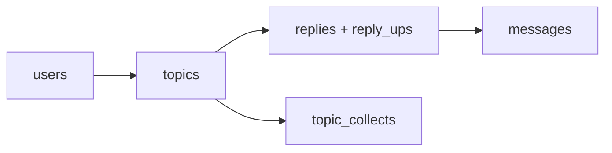

# Migration Background

Mongo-to-PostgreSQL 迁移的历史字段映射、跳过逻辑和报告机制。当前数据库开发与 reviewed migration 规则见 [docs/database.md](../docs/database.md)。

## Sources

- `scripts/migrate-mongo-to-pg.ts` — 迁移主脚本。
- `scripts/reconcile-migration.ts` — 对账脚本。
- `packages/db/src/schema/` — PostgreSQL target schema。
- `deployment/docker-compose.yml` — `migrate-schema`、`migrate-data`、`reconcile` profiles。
- `../nodeclub/models/` — legacy Mongo schema 定义。

## Scope

记录迁移工具的字段映射、ID 策略、跳过逻辑和报告结构，不作为日常部署操作入口。

## Migration Order



ID map 必须先于数据迁移构建，因为 topics 引用 users，replies 引用 topics 和 users，messages 引用所有前三者。

## ID Mapping Strategy

| Source | Target | Strategy |
| ------ | ------ | -------- |
| Mongo `ObjectId` | PostgreSQL `serial` integer | 按 `_id` 升序从 1 递增分配 |
| ID map | `Map<string, number>` | 全表扫描构建，内存保存 |

`buildIdMap` 按 `_id` 升序遍历，分配 1, 2, 3...。`mapId` 通过 ObjectId hex string 查找对应整数。

## Field Mapping

### users

| Mongo field | PG column | Transform |
| ----------- | --------- | --------- |
| `_id` | `id` | ObjectId → integer via map |
| `loginname` / `name` | `loginname` | `cleanText`, fallback `legacy_user_{id}`, dedupe via suffix |
| `pass` | `pass` | `cleanText`, null if missing |
| `email` | `email` | `cleanText`, fallback `{loginname}-{id}@legacy.invalid`, dedupe |
| `url` | `url` | `cleanText` |
| `profile_image_url` | `profile_image_url` | `cleanText` |
| `location` | `location` | `cleanText` |
| `signature` | `signature` | `cleanText` |
| `profile` | `profile` | `cleanText` |
| `weibo` | `weibo` | `cleanText` |
| `avatar` / `avatar_url` | `avatar` | `cleanText`, prefer `avatar` then `avatar_url` |
| `githubId` / `github_id` | `github_id` | `cleanText`, prefer camelCase |
| `githubUsername` / `github_username` | `github_username` | `cleanText`, prefer camelCase |
| `githubAccessToken` / `github_access_token` | `github_access_token` | `cleanText`, prefer camelCase |
| `is_block` | `is_block` | `toBool` |
| `score` | `score` | `Number(… \|\| 0)` |
| `topic_count` | `topic_count` | `Number(… \|\| 0)` |
| `reply_count` | `reply_count` | `Number(… \|\| 0)` |
| `collect_topic_count` | `collect_topic_count` | `Number(… \|\| 0)` |
| `is_star` | `is_star` | `toBool`, null if missing |
| `level` | `level` | `cleanText` |
| `active` | `active` | `toBool` |
| `accessToken` / `access_token` | `access_token` | `cleanText`, prefer camelCase |
| `receive_reply_mail` | `receive_reply_mail` | `toBool` |
| `receive_at_mail` | `receive_at_mail` | `toBool` |
| `retrieve_key` | `retrieve_key` | `cleanText` |
| `retrieve_time` | `retrieve_time` | passthrough |
| `create_at` | `create_at` | `toDate`, fallback `new Date(0)` |
| `update_at` | `update_at` | `toDate`, fallback `create_at` then `new Date(0)` |

Login name 和 email dedupe：遇到重复时追加 `__legacy_{objectId}` 后缀。

### topics

| Mongo field | PG column | Transform |
| ----------- | --------- | --------- |
| `_id` | `id` | map |
| `title` | `title` | `cleanText` |
| `content` | `content` | `cleanText` |
| `author_id` | `author_id` | `mapId(userMap)`，缺失则 skip |
| `tab` | `tab` | `cleanText` |
| `top` | `top` | `toBool` |
| `good` | `good` | `toBool` |
| `lock` | `lock` | `toBool` |
| (none) | `status` | default `published` |
| `reply_count` | `reply_count` | `Number(… \|\| 0)` |
| `visit_count` | `visit_count` | `Number(… \|\| 0)` |
| `collect_count` | `collect_count` | `Number(… \|\| 0)` |
| `last_reply` | `last_reply_id` | `mapId(replyMap)` |
| `last_reply_at` | `last_reply_at` | `toDate` |
| (none) | `archived` | `toBool` |
| `deleted` | `deleted` | `toBool` |
| `create_at` | `create_at` | `toDate`, fallback `new Date(0)` |
| `update_at` | `update_at` | `toDate`, fallback chain |

`content_is_html` 字段不迁移——cnode-next 统一用 `mdrender` 参数控制渲染。

### replies + reply_ups

| Mongo field | PG column | Transform |
| ----------- | --------- | --------- |
| `_id` | `id` | map |
| `content` | `content` | `cleanText` |
| `topic_id` | `topic_id` | `mapId(topicMap)`，缺失则 skip |
| `author_id` | `author_id` | `mapId(userMap)`，缺失则 skip |
| `reply_id` | `reply_id` | `mapId(replyMap)` |
| `deleted` | `deleted` | `toBool` |
| `create_at` | `create_at` | `toDate`, fallback `new Date(0)` |
| `update_at` | `update_at` | `toDate`, fallback chain |
| `ups[]` | `reply_ups` rows | 每个 ObjectId → `(reply_id, user_id)`，`on conflict do nothing` |

`content_is_html` 不迁移。

### messages

| Mongo field | PG column | Transform |
| ----------- | --------- | --------- |
| `_id` | `id` | map |
| `type` | `type` | `cleanText` |
| `master_id` | `master_id` | `mapId(userMap)`，缺失则 skip |
| `author_id` | `author_id` | `mapId(userMap)`，缺失则 skip |
| `topic_id` | `topic_id` | `mapId(topicMap)` |
| `reply_id` | `reply_id` | `mapId(replyMap)` |
| `has_read` | `has_read` | `toBool` |
| `create_at` | `create_at` | `toDate`, fallback `new Date(0)` |

### topic_collects

| Mongo field | PG column | Transform |
| ----------- | --------- | --------- |
| `user_id` | `user_id` | `mapId(userMap)`，缺失则 skip |
| `topic_id` | `topic_id` | `mapId(topicMap)`，缺失则 skip |
| `create_at` | `create_at` | `toDate`, fallback `new Date(0)` |

Collection name 自动探测：`firstCollectionName(["topiccollects", "topic_collects"])`。

## Skip Logic

| Skip key | Condition | Effect |
| -------- | --------- | ------ |
| `topicsMissingAuthor` | `author_id` 在 userMap 中找不到 | 跳过该 topic |
| `repliesMissingTopic` | `topic_id` 找不到 | 跳过 reply + 其所有 ups |
| `repliesMissingAuthor` | `author_id` 找不到 | 跳过 reply + 其所有 ups |
| `messagesMissingMaster` | `master_id` 找不到 | 跳过 message |
| `messagesMissingAuthor` | `author_id` 找不到 | 跳过 message |
| `replyUpsMissingUser` | `ups[]` 中的 user 找不到 | 跳过该 up，保留 reply |
| `topicCollectsMissingUser` | `user_id` 找不到 | 跳过 collect |
| `topicCollectsMissingTopic` | `topic_id` 找不到 | 跳过 collect |

每个 skip 记录 count 和最多 20 个 sample ObjectId。

## Migration Report

```json
{
  "startedAt": "ISO timestamp",
  "completedAt": "ISO timestamp",
  "source": { "users": N, "topics": N, "replies": N, "messages": N },
  "skipped": {
    "topicsMissingAuthor": { "count": N, "samples": ["oid", ...] },
    ...
  }
}
```

Report 写入 `MIGRATION_REPORT_PATH`（默认 `/app/migration-report.json`），compose 挂载到 `deployment/migration-reports/`。

## Target Reset

迁移前 `truncate table topic_collects, reply_ups, messages, replies, topics, users restart identity cascade`，清空所有目标表并重置 serial sequence。

迁移完成后 `resetSequences` 对 `users`、`topics`、`replies`、`messages` 执行 `setval` 确保 auto-increment 从 max(id) 继续。

## Reconciliation

`pnpm migrate:reconcile` 读取 migration report，比对源和目标的行数：

- users
- topics
- replies
- messages
- reply likes (`reply_ups`)

对账失败则阻止 cutover。

## Transform Functions

| Function | Behavior |
| -------- | -------- |
| `toDate(value)` | Date passthrough, `new Date(string)` fallback, NaN → null |
| `toBool(value)` | `true \|\| 1 \|\| "1"` → true, else false |
| `cleanText(value, fallback)` | `String(value ?? fallback)`, 移除 `\0` |
| `oid(value)` | ObjectId → hex string, else `String(value)` |
| `mapId(map, value)` | oid → lookup in map → integer or null |
| `uniqueValue(value, seen, suffix)` | dedupe with `__legacy_{suffix}` suffix |

## Inferences

- 因为 ID map 按ObjectId升序从 1 分配，迁移后 ID 与 legacy 不一致，外部引用 legacy ObjectId 的链接会失效。
- 因为 loginname/email dedupe 使用 `__legacy_{objectId}` 后缀，重复账号在迁移后会改名，可能影响用户登录。
- 因为 `content_is_html` 不迁移，legacy 中存储预渲染 HTML 的话题/回复在迁移后会被当作 Markdown 重新渲染，可能与原始展示不一致。
- 因为 `resetTarget` 清空所有表，rehearsal 和 production 迁移不能在同一数据库上交叉进行。
- 因为 skip 逻辑只记录不阻断，迁移可能静默丢失数据；reconciliation 是最终防线。

## Review Status

- Draft, extracted from migration source during `simplify-open-source-docs` cleanup.
